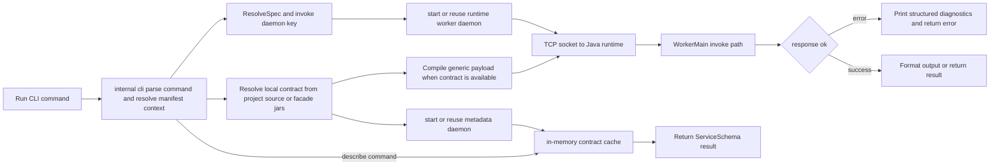

# sofarpc-cli

CLI for invoking and debugging SOFARPC services.

Architecture (deliberately polyglot, each language kept to what it does best):

- **Go** — CLI control plane, project discovery, local contract resolution,
  metadata daemon, daemon lifecycle, and runtime cache. Fast cold start,
  clean Windows subprocess semantics, single-binary distribution.
- **Java** — SOFARPC invoke worker plus source/jar analyzers used to recover
  facade contracts without keeping business jars inside the long-lived worker.

Start here:

- usage and command reference: [docs/usage.md](./docs/usage.md)
- design notes: [docs/sofarpc-cli-design.md](./docs/sofarpc-cli-design.md)

Core product surface:

- `call`
- `describe`
- `doctor`
- `target`

Optional project tooling:

- `facade discover`
- `facade index`
- `facade services`
- `facade schema`
- `facade replay`
- `facade status`

## Runtime Workflow



Notes:

- service schema is resolved locally first from project source, then facade jars,
  and cached in a dedicated metadata daemon; no contract artifacts are written to disk
- when local contract resolution succeeds, the long-lived invoke worker runs with
  a runtime-only classpath instead of loading business jars
- cache is process-lifetime only; refresh is supported via `call --refresh-contract`,
  `doctor --refresh-contract`, and `describe --refresh`
- `.sofarpc/` is an optional facade workspace state directory used only by
  project tooling such as discover/index/replay; the core
  `call/describe/doctor/target` flow does not require it

## Quick Start

Build:

```powershell
mvn -f runtime-worker-java/pom.xml package
go build -o bin/sofarpc ./cmd/sofarpc
```

Run:

```powershell
go run ./cmd/sofarpc help
```

Optional project helper commands:

```powershell
sofarpc facade discover --write
sofarpc facade index
sofarpc facade services
sofarpc facade schema com.example.UserFacade.getUser
sofarpc facade replay
sofarpc facade status
```

## Agent Skill

The repo ships a `call-rpc` agent skill that triggers `sofarpc call` for
SOFABoot projects. Install once at user scope:

```powershell
sofarpc skills install                    # default target: claude
sofarpc skills install --target codex     # install under ~/.agents/skills/
sofarpc skills install --target both      # install for both Claude and Codex
sofarpc skills where                      # show source / target paths
```

The skill intentionally does not handle facade discovery, index generation,
saved-call replay, or result interpretation. It is a thin wrapper around the
`sofarpc call` command.

For full usage, examples, manifest format, runtime source management, and
diagnostics, see [docs/usage.md](./docs/usage.md).
