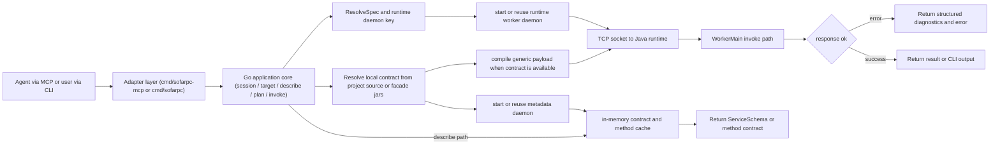

# sofarpc-cli

CLI and local MCP server for invoking and debugging SOFARPC services.

The repo is now intentionally agent-first:

- **Primary surface**: local MCP server with typed tools and workspace session state
- **Secondary surface**: human-facing CLI commands for manual invocation and diagnostics
- **Tertiary surface**: bundled skills that bootstrap or fall back to CLI flows

Architecture (deliberately polyglot, each language kept to what it does best):

- **Go** — application core, CLI/MCP adapters, project discovery, local contract resolution,
  metadata daemon, daemon lifecycle, and runtime cache. Fast cold start,
  clean Windows subprocess semantics, single-binary distribution.
- **Java** — SOFARPC invoke worker plus source/jar analyzers used to recover
  facade contracts without keeping business jars inside the long-lived worker.

Start here:

- usage and command reference: [docs/usage.md](./docs/usage.md)
- design notes: [docs/sofarpc-cli-design.md](./docs/sofarpc-cli-design.md)

## Product Surfaces

Primary agent surface (MCP tools):

- `open_workspace_session`
- `resume_context`
- `inspect_session`
- `resolve_target`
- `describe_method`
- `plan_invocation`
- `invoke_rpc`
- `list_facade_services`

Secondary manual surface (CLI commands):

- `call`
- `describe`
- `doctor`
- `target`

Optional project tooling:

- `facade discover`
- `facade index`
- `facade services`
- `facade schema`
- `facade replay`
- `facade status`

## Runtime Workflow



Notes:

- service schema is resolved locally first from project source, then facade jars,
  and cached in a dedicated metadata daemon; no contract artifacts are written to disk
- when local contract resolution succeeds, the long-lived invoke worker runs with
  a runtime-only classpath instead of loading business jars
- workspace session state remembers the last resolved target, method describe,
  and invocation plan so agents can resume with fewer arguments
- `resume_context` returns both the next recommended tool and a draft call shape
  that can come from facade schema or param-type fallback
- cache is process-lifetime only; refresh is supported via `call --refresh-contract`,
  `doctor --refresh-contract`, and `describe --refresh`
- `.sofarpc/` is an optional facade workspace state directory used only by
  project tooling such as discover/index/replay; the core invoke/diagnostic path does not require it

## Quick Start

Build:

```powershell
mvn -f runtime-worker-java/pom.xml package
go build -o bin/sofarpc ./cmd/sofarpc
go build -o bin/sofarpc-mcp ./cmd/sofarpc-mcp
```

Run the CLI:

```powershell
go run ./cmd/sofarpc help
```

Run the MCP server:

```powershell
go run ./cmd/sofarpc-mcp
```

Typical MCP flow:

1. `open_workspace_session`
2. `resume_context`
3. `resolve_target`
4. `describe_method`
5. `plan_invocation`
6. `invoke_rpc`

After a plan exists in the session, `invoke_rpc` can usually be called again with only `session_id`.

Optional project helper commands:

```powershell
sofarpc facade discover --write
sofarpc facade index
sofarpc facade services
sofarpc facade schema com.example.UserFacade.getUser
sofarpc facade replay
sofarpc facade status
```

## Agent Skill

The repo still ships a `call-rpc` agent skill, but it is now a thin tertiary adapter.
Preferred agent integration is the local MCP server.

Install the skill once at user scope when you want CLI-based fallback:

```powershell
sofarpc skills install                    # default target: claude
sofarpc skills install --target codex     # install under ~/.agents/skills/
sofarpc skills install --target both      # install for both Claude and Codex
sofarpc skills where                      # show source / target paths
```

The skill intentionally does not handle facade discovery, index generation,
saved-call replay, or result interpretation. It is a thin wrapper around the
`sofarpc call` command.

For full usage, examples, manifest format, runtime source management, and
diagnostics, see [docs/usage.md](./docs/usage.md).
