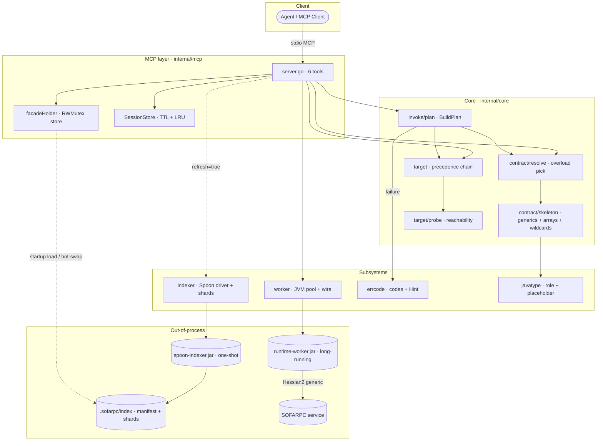
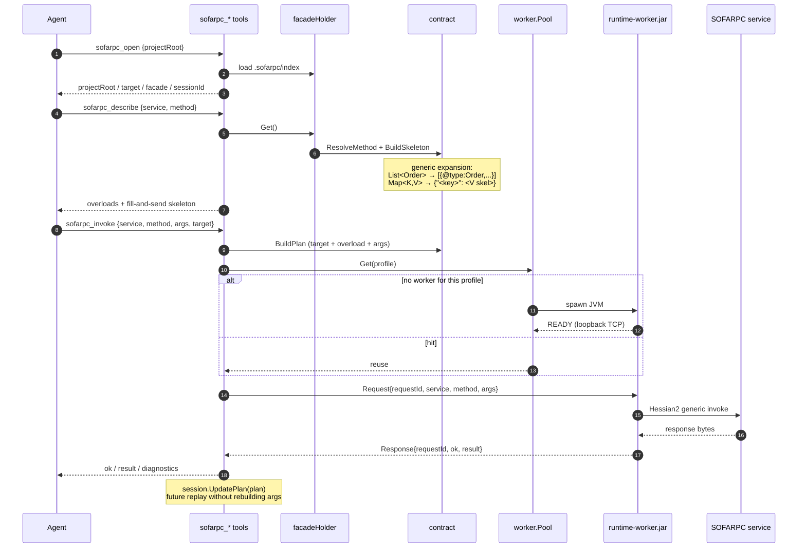
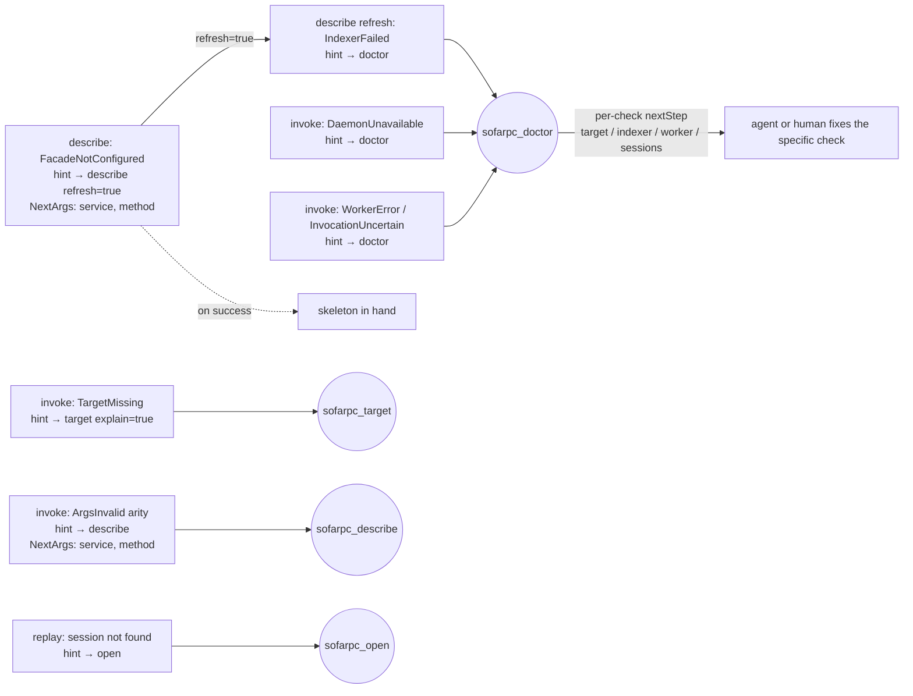

# sofarpc-cli

Agent-first local MCP server for invoking and debugging SOFARPC services.

- **Design**: [docs/architecture.md](./docs/architecture.md)
- **Primary surface**: one MCP server (`cmd/sofarpc-mcp`) exposing six typed tools
- **Polyglot by design**: Go owns orchestration, config, cache, and process
  lifecycle; Java owns SOFARPC generic invoke and Spoon-based source analysis

## The six MCP tools

| Tool | Purpose |
| --- | --- |
| `sofarpc_open` | Open a workspace. Returns project root, resolved target, facade state, session id. |
| `sofarpc_target` | Resolve and probe the invocation target (precedence chain + reachability). |
| `sofarpc_describe` | Resolve overloads and render a JSON skeleton from the facade index. `refresh=true` regenerates the index. |
| `sofarpc_invoke` | Plan and execute a generic invocation. `dryRun=true` stops after planning. |
| `sofarpc_replay` | Replay a captured plan — from a session id or a verbatim payload. |
| `sofarpc_doctor` | End-to-end self-diagnosis: config, indexer, worker pool load, session cap, target reachability. |

Every failure carries a stable `errcode.Code` plus a `nextTool` hint so agents
recover without reading prose. Hints pre-fill required inputs (e.g. `service`,
`method`, `sessionId`, `refresh=true`) so the agent can follow them verbatim
without re-deriving context from the failed call. See
[architecture §4](./docs/architecture.md) for the taxonomy.

## Architecture at a glance



- Facade metadata is produced by a one-shot Spoon subprocess that writes
  `.sofarpc/index/_index.json` + per-class shards; Go reads directly.
- The invoke worker is a long-running JVM per `profile = sha256(sofaRpcVersion | runtimeJarDigest | javaMajor)`
  keyed by the pool. Workers multiplex requests over one loopback TCP conn
  demuxed by `requestId`. Idle workers are reaped by TTL and the pool evicts
  LRU slots when it hits its cap, so profile churn can't starve the host.
- The MCP server handles `SIGINT`/`SIGTERM` and closes the worker pool within
  a bounded grace window, so a wedged JVM can't keep the process alive.
- No on-disk cache of contracts. No metadata daemon. No plugin system.

## Quick start

Build:

```sh
go build -o bin/sofarpc-mcp ./cmd/sofarpc-mcp
```

Configure via environment (empty vars are fine — tools degrade gracefully):

```sh
# Target (pick one)
export SOFARPC_DIRECT_URL=bolt://host:12200
# export SOFARPC_REGISTRY_ADDRESS=zookeeper://...

# Invoke worker
export SOFARPC_RUNTIME_JAR=/abs/path/runtime-worker.jar
export SOFARPC_RUNTIME_JAR_DIGEST=sha256-of-jar
export SOFARPC_VERSION=5.12.0          # optional, default "unknown"
export SOFARPC_JAVA_MAJOR=17           # optional, default 17
export SOFARPC_JAVA=/path/to/java      # optional, default "java" on PATH

# Indexer (enables sofarpc_describe refresh=true)
export SOFARPC_INDEXER_JAR=/abs/path/spoon-indexer.jar
# export SOFARPC_INDEXER_SOURCES=/abs/src1:/abs/src2   # default: <root>/src/main/java
# export SOFARPC_INDEXER_JAVA=/path/to/jdk11/bin/java  # default: SOFARPC_JAVA; set when indexer needs a newer JDK than the worker
export SOFARPC_PROJECT_ROOT=/abs/project/root          # default: CWD
```

Run:

```sh
./bin/sofarpc-mcp
```

The server speaks stdio MCP. Point any MCP-capable agent at it.

## Typical agent flow

1. `sofarpc_open` — establish project + session
2. `sofarpc_target` — confirm target resolves and reaches
3. `sofarpc_describe` — pick overload, get JSON skeleton
4. `sofarpc_invoke` — send the call (or `dryRun=true` first to inspect the plan)
5. `sofarpc_replay` — re-run from the session without rebuilding args
6. `sofarpc_doctor` — when anything goes wrong, the catch-all diagnostic



## Recovery chain

Every failure surfaces a stable `errcode.Code` plus a `nextTool` hint with
pre-filled `NextArgs` — agents follow the hint verbatim instead of reading
prose and re-deriving context.



## Repo layout

```
cmd/sofarpc-mcp/          single MCP entrypoint
internal/
  mcp/                    tool registration + handler shims
  errcode/                stable error codes + NextStep hints
  core/
    contract/             Resolve + skeleton render
    target/               precedence chain + reachability probe
    invoke/               plan + execute
    workspace/            project root resolution
  indexer/                Spoon indexer subprocess driver + shard reader
  worker/                 JVM worker pool + wire protocol
  facadesemantic/         shapes mirroring indexer output
  javatype/               role classification
docs/
  architecture.md         the one design doc to read
```

## Status

- Go side: feature-complete end-to-end (six tools, indexer driver, worker pool,
  session-tagged replay, self-heal hints) — all green under `go test -race ./...`.
- Java side: the two jars (`spoon-indexer-java`, `runtime-worker-java`) are not
  in this repo yet. The Go driver fully specifies their wire contract
  (architecture §6 + §7) so they can be built independently.
