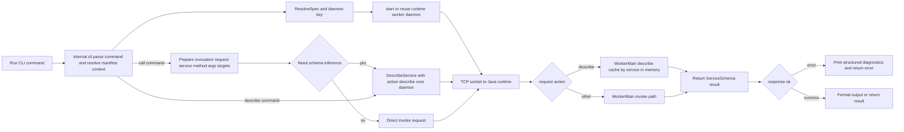

# sofarpc-cli

CLI for invoking SOFARPC services.

Architecture (deliberately polyglot, each language kept to what it does best):

- **Go** — CLI control plane, daemon lifecycle, runtime cache. Fast cold
  start, clean Windows subprocess semantics, single-binary distribution.
- **Java** — SOFARPC worker runtime plus the Spoon-based facade indexer.

Start here:

- usage and command reference: [docs/usage.md](./docs/usage.md)
- design notes: [docs/sofarpc-cli-design.md](./docs/sofarpc-cli-design.md)

## Runtime Workflow



Notes:

- schema cache is now kept in the runtime daemon JVM memory, shared by CLI processes using the same daemon key;
- cache is process-lifetime only: no local schema files are written.
- schema refresh is supported via `refresh`/`no-cache` (goes into daemon describe request).

## Quick Start

Build:

```powershell
mvn -f runtime-worker-java/pom.xml package
go build -o bin/sofarpc ./cmd/sofarpc
```

Run:

```powershell
go run ./cmd/sofarpc help
```

## Claude Code skills

The repo ships a `call-rpc` Claude Code skill that triggers `sofarpc call` for
SOFABoot projects. Install once at user scope:

```powershell
sofarpc skills install          # copies skills/call-rpc -> ~/.claude/skills/
sofarpc skills where            # show source / target paths
```

The skill intentionally does not handle project bootstrap, index generation,
cases, or result interpretation. It is a thin wrapper around the `sofarpc call`
command.

For full usage, examples, manifest format, runtime source management, and
diagnostics, see [docs/usage.md](./docs/usage.md).
