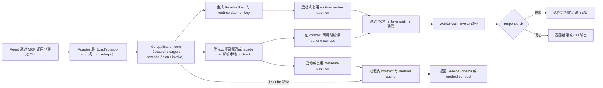

# sofarpc-cli

用于调用和调试 SOFARPC 服务的 CLI 与本地 MCP Server。

这个仓库现在已经明确转成 agent-first：

- **主入口**：带类型化工具和 workspace session 状态的本地 MCP server
- **次入口**：给人手工调用和排障用的 CLI 命令
- **第三入口**：作为 bootstrap 或 fallback 的内置 skill

结构（有意多语言，各自做自己最擅长的事）：

- **Go** —— application core、CLI/MCP adapter、项目发现、本地 contract 解析、
  metadata daemon、daemon 生命周期与 runtime 缓存。冷启动快、Windows 子进程语义干净、
  单文件二进制分发。
- **Java** —— 随目标版本对齐的 SOFARPC invoke worker，以及用于从源码或 jar
  恢复 facade contract 的分析器，不再要求长驻 worker 挂业务 jar。

入口文档：

- 使用说明和命令参考：[docs/usage.zh-CN.md](./docs/usage.zh-CN.md)
- 设计文档：[docs/sofarpc-cli-design.md](./docs/sofarpc-cli-design.md)

## 产品入口

主 agent 入口（MCP tools）：

- `open_workspace_session`
- `resume_context`
- `inspect_session`
- `resolve_target`
- `describe_method`
- `plan_invocation`
- `invoke_rpc`
- `list_facade_services`

手工入口（CLI 命令）：

- `call`
- `describe`
- `doctor`
- `target`

可选项目增强命令：

- `facade discover`
- `facade index`
- `facade services`
- `facade schema`
- `facade replay`
- `facade status`

## 运行流程



说明：

- service schema 会优先从本地项目源码、其次从 facade jar 解析，并缓存到独立的 metadata daemon；
- contract 结果只放进进程内存，不写本地文件；
- 本地 contract 可用时，长驻 invoke worker 只保留 runtime classpath，不再挂业务 jar；
- workspace session 会记住最近一次的 target、describe 和 invocation plan，agent 后续可以减少显式传参；
- `resume_context` 不只返回“下一步该调哪个 tool”，还会返回一份来自 facade schema 或 param-type fallback 的调用草案；
- 可通过 `call --refresh-contract`、`doctor --refresh-contract` 和 `describe --refresh` 强制刷新；
- `.sofarpc/` 是可选的 facade workspace 状态目录，只服务于 discover/index/replay 这类项目增强能力；核心调用与诊断主链不依赖它。

## 快速开始

构建：

```powershell
mvn -f runtime-worker-java/pom.xml package
go build -o bin/sofarpc ./cmd/sofarpc
go build -o bin/sofarpc-mcp ./cmd/sofarpc-mcp
```

运行 CLI：

```powershell
go run ./cmd/sofarpc help
```

运行 MCP Server：

```powershell
go run ./cmd/sofarpc-mcp
```

典型 MCP 调用链：

1. `open_workspace_session`
2. `resume_context`
3. `resolve_target`
4. `describe_method`
5. `plan_invocation`
6. `invoke_rpc`

一旦 session 里已经存在可用 plan，后续通常只传 `session_id` 就能再次执行 `invoke_rpc`。

可选项目辅助命令：

```powershell
sofarpc facade discover --write
sofarpc facade index
sofarpc facade services
sofarpc facade schema com.example.UserFacade.getUser
sofarpc facade replay
sofarpc facade status
```

## Agent Skill

仓库仍然内置 `call-rpc` skill，但它现在只是第三层 adapter。
对 agent 来说，优先集成方式应该是本地 MCP server。

如果你需要 CLI fallback，再做一次用户级安装：

```powershell
sofarpc skills install                    # 默认安装到 Claude
sofarpc skills install --target codex     # 安装到 ~/.agents/skills/
sofarpc skills install --target both      # 同时安装到 Claude 和 Codex
sofarpc skills where                      # 查看源路径 / 目标路径
```

该 skill 不负责：

- 接入项目、构建索引、回放已保存调用
- 结果验证和业务语义解读

它只负责把一次调用映射到 `sofarpc call` 命令并透传执行结果。

完整用法、manifest 格式、runtime source 管理和诊断命令，请看
[docs/usage.zh-CN.md](./docs/usage.zh-CN.md)。
