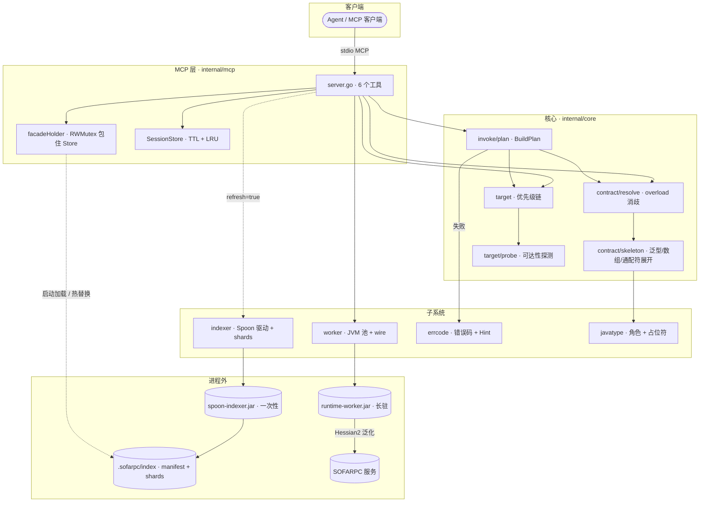
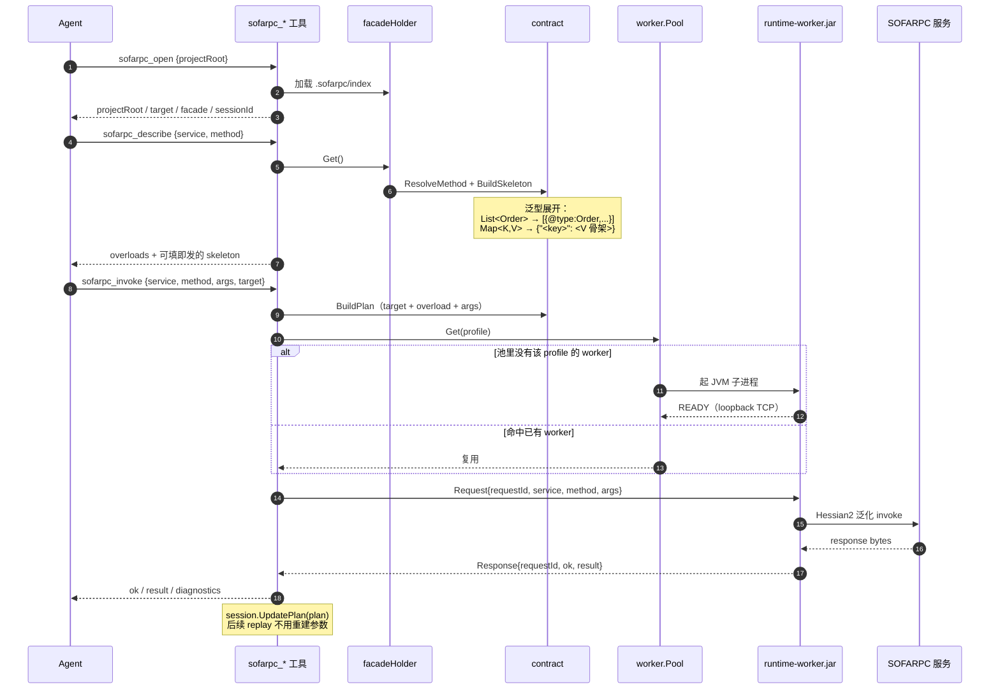
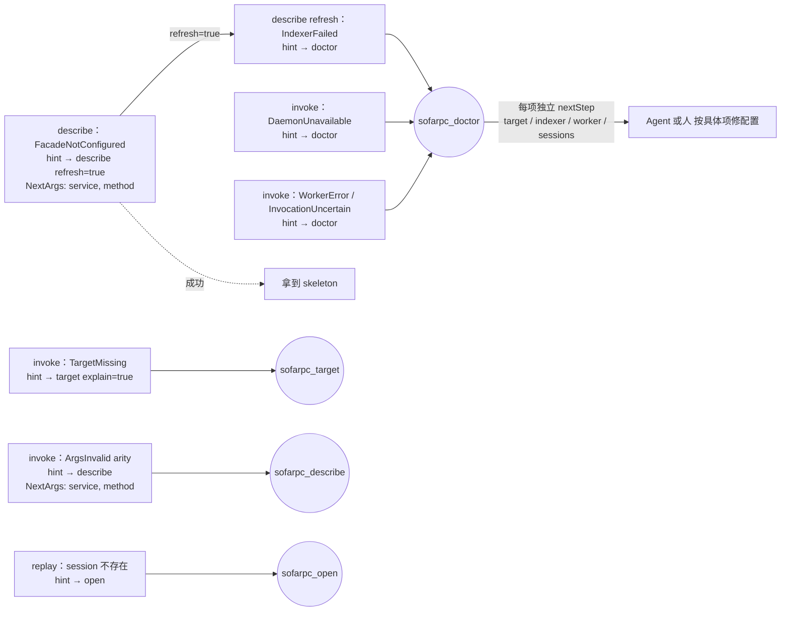

# sofarpc-cli

Agent-first 的本地 MCP Server，用于调用和调试 SOFARPC 服务。

- **设计文档**：[docs/architecture.md](./docs/architecture.md)
- **主入口**：单一 MCP Server（`cmd/sofarpc-mcp`），暴露 6 个强类型工具
- **多语言分工**：Go 负责编排、配置、缓存、进程生命周期；Java 负责 SOFARPC
  泛化调用和基于 Spoon 的源码分析

## 六个 MCP 工具

| 工具 | 用途 |
| --- | --- |
| `sofarpc_open` | 打开工作区。返回项目根目录、已解析的 target、facade 状态、session id。 |
| `sofarpc_target` | 解析并探测调用目标（优先级链 + 可达性）。 |
| `sofarpc_describe` | 解析方法重载并生成 JSON 骨架；`refresh=true` 会重新生成 facade 索引。 |
| `sofarpc_invoke` | 规划并执行一次泛化调用；`dryRun=true` 只做 plan。 |
| `sofarpc_replay` | 重放一次已捕获的 plan——可以来自 session id，也可以是完整 payload。 |
| `sofarpc_doctor` | 端到端自检：配置、indexer、worker 池负载、session 上限、target 可达性。 |

每个失败都带稳定的 `errcode.Code` 和 `nextTool` 提示，Agent 不需要读文字也能
继续前进。提示会预填必要的入参（如 `service`、`method`、`sessionId`、
`refresh=true`），Agent 可以原样执行，无需从失败调用里再推导一遍上下文。
错误码分类见 [architecture §4](./docs/architecture.md)。

## 结构概览



- Facade 元数据由一次性的 Spoon 子进程产出，写入
  `.sofarpc/index/_index.json` 及每类一份的 shard；Go 直接读取。
- Invoke worker 是长驻 JVM，按
  `profile = sha256(sofaRpcVersion | runtimeJarDigest | javaMajor)` 分组进池；
  所有请求在同一个 loopback TCP 上按 `requestId` 多路复用。空闲 worker 会按
  TTL 被回收，池容量超限时按 LRU 驱逐，profile 频繁切换也不会把主机资源打满。
- MCP Server 会响应 `SIGINT`/`SIGTERM`，在有限宽限期内关闭 worker 池；
  即使某个 JVM 卡住，也不会阻塞进程退出。
- 不落盘 contract 缓存、无 metadata daemon、无插件机制。

## 快速开始

构建：

```sh
go build -o bin/sofarpc-mcp ./cmd/sofarpc-mcp
```

通过环境变量配置（空值可以接受，工具会优雅降级）：

```sh
# Target（二选一）
export SOFARPC_DIRECT_URL=bolt://host:12200
# export SOFARPC_REGISTRY_ADDRESS=zookeeper://...

# Invoke worker
export SOFARPC_RUNTIME_JAR=/abs/path/runtime-worker.jar
export SOFARPC_RUNTIME_JAR_DIGEST=sha256-of-jar
export SOFARPC_VERSION=5.12.0          # 可选，默认 "unknown"
export SOFARPC_JAVA_MAJOR=17           # 可选，默认 17
export SOFARPC_JAVA=/path/to/java      # 可选，默认使用 PATH 中的 "java"

# Indexer（启用 sofarpc_describe refresh=true）
export SOFARPC_INDEXER_JAR=/abs/path/spoon-indexer.jar
# export SOFARPC_INDEXER_SOURCES=/abs/src1:/abs/src2   # 默认 <root>/src/main/java
# export SOFARPC_INDEXER_JAVA=/path/to/jdk11/bin/java  # 默认回落到 SOFARPC_JAVA；indexer 需要比 worker 更新的 JDK 时单独指定
export SOFARPC_PROJECT_ROOT=/abs/project/root          # 默认当前工作目录
```

启动：

```sh
./bin/sofarpc-mcp
```

Server 使用 stdio MCP 协议，把任意支持 MCP 的 Agent 接上即可。

## 典型 Agent 调用链

1. `sofarpc_open`——建立项目 + session
2. `sofarpc_target`——确认 target 能解析并可达
3. `sofarpc_describe`——选择重载、拿到 JSON 骨架
4. `sofarpc_invoke`——真正发起调用（或先 `dryRun=true` 看 plan）
5. `sofarpc_replay`——基于 session 再次执行，无需重建参数
6. `sofarpc_doctor`——兜底自检，任何问题都可以走这里



## 出错恢复链路

每个失败都返回稳定的 `errcode.Code` + `nextTool` hint，`NextArgs` 已经预填好——
Agent 原样执行下一跳即可，不用读散文、不用从失败调用再推导上下文。



## 目录结构

```
cmd/sofarpc-mcp/          唯一的 MCP 入口
internal/
  mcp/                    工具注册和 handler 接入
  errcode/                稳定的错误码 + NextStep 提示
  core/
    contract/             方法解析 + 骨架生成
    target/               优先级链 + 可达性探测
    invoke/               plan + execute
    workspace/            项目根目录解析
  indexer/                Spoon 索引子进程驱动 + shard reader
  worker/                 JVM worker 池 + wire 协议
  facadesemantic/         与 indexer 输出对齐的 shape
  javatype/               字段角色分类
docs/
  architecture.md         唯一必读的设计文档
```

## 进度

- Go 侧：端到端已闭合（六个工具、indexer 驱动、worker 池、session-tagged
  replay、自愈提示），`go test -race ./...` 全绿。
- Java 侧：两个 jar（`spoon-indexer-java`、`runtime-worker-java`）还没进仓。
  Go 驱动已经完整定义它们的 wire 协议（architecture §6 + §7），可以独立实现。
