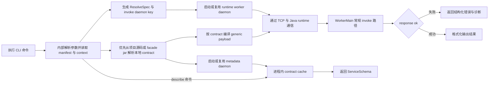

# sofarpc-cli

用于调用和调试 SOFARPC 服务的 CLI。

结构（有意多语言，各自做自己最擅长的事）：

- **Go** —— CLI 控制面、项目发现、本地 contract 解析、metadata daemon、
  daemon 生命周期与 runtime 缓存。冷启动快、Windows 子进程语义干净、
  单文件二进制分发。
- **Java** —— 随目标版本对齐的 SOFARPC invoke worker，以及用于从源码或 jar
  恢复 facade contract 的分析器，不再要求长驻 worker 挂业务 jar。

入口文档：

- 使用说明和命令参考：[docs/usage.zh-CN.md](./docs/usage.zh-CN.md)
- 设计文档：[docs/sofarpc-cli-design.md](./docs/sofarpc-cli-design.md)

核心产品命令：

- `call`
- `describe`
- `doctor`
- `target`

项目增强命令：

- `facade discover`
- `facade index`
- `facade services`
- `facade schema`
- `facade replay`
- `facade status`

## 运行流程



说明：

- service schema 会优先从本地项目源码、其次从 facade jar 解析，并缓存到独立的 metadata daemon；
- contract 结果只放进进程内存，不写本地文件；
- 本地 contract 可用时，长驻 invoke worker 只保留 runtime classpath，不再挂业务 jar；
- 可通过 `call --refresh-contract`、`doctor --refresh-contract` 和 `describe --refresh` 强制刷新。
- `.sofarpc/` 是可选的 facade workspace 状态目录，只服务于
  discover/index/replay 这类项目辅助能力；核心
  `call/describe/doctor/target` 主链不依赖它。

## 快速开始

构建：

```powershell
mvn -f runtime-worker-java/pom.xml package
go build -o bin/sofarpc ./cmd/sofarpc
```

运行：

```powershell
go run ./cmd/sofarpc help
```

可选项目辅助命令：

```powershell
sofarpc facade discover --write
sofarpc facade index
sofarpc facade services
sofarpc facade schema com.example.UserFacade.getUser
sofarpc facade replay
sofarpc facade status
```

## Agent Skill

仓库内置 `call-rpc` skill，安装后就是“触发 `sofarpc call` 的薄入口”。
用户级安装一次即可：

```powershell
sofarpc skills install                    # 默认安装到 Claude
sofarpc skills install --target codex     # 安装到 ~/.agents/skills/
sofarpc skills install --target both      # 同时安装到 Claude 和 Codex
sofarpc skills where                      # 查看源路径 / 目标路径
```

该 skill 不负责：
- 接入项目、构建索引、回放已保存调用
- 结果验证和业务语义解读

它只负责把一次调用映射到 `sofarpc call` 命令并透传执行结果。

完整用法、manifest 格式、runtime source 管理和诊断命令，请看
[docs/usage.zh-CN.md](./docs/usage.zh-CN.md)。
