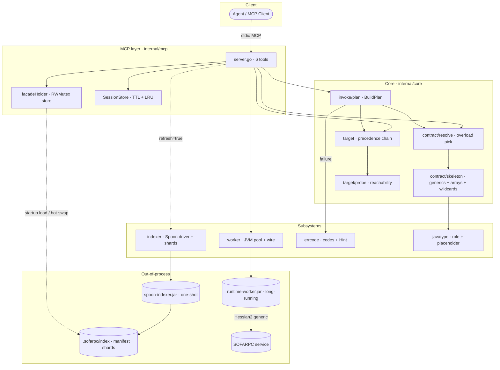
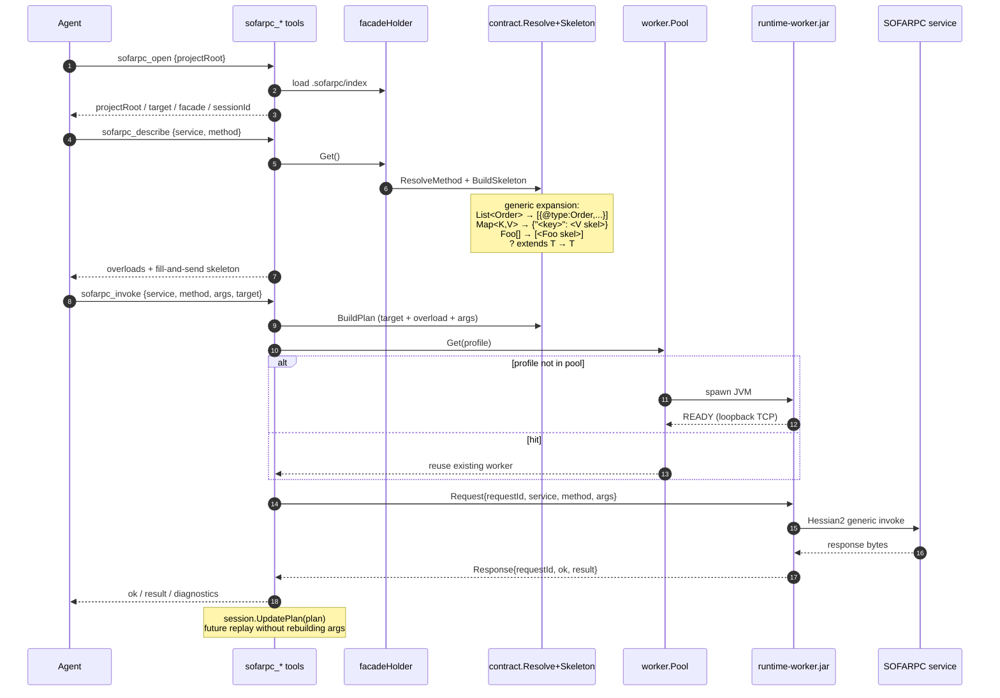
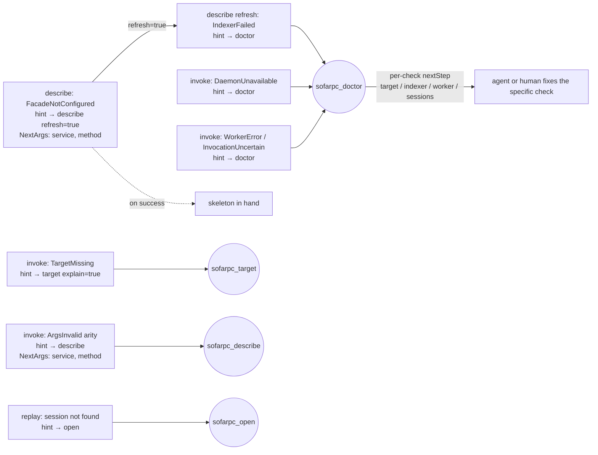

# sofarpc-cli Architecture (agent-first rewrite)

This document is the source of truth for the rewrite on the `rewrite` branch.
It describes the target state — not a migration path (that lives in
[`improvement-plan.md`](improvement-plan.md)).

## 1. Principles

1. **Agent-first surface.** Every failure returns a stable `code` plus a
   `nextStep{nextTool, nextArgs, reason}` hint the agent can call directly.
   No free-form prose recovery. See `internal/errcode`.
2. **Three processes only.** A Go control plane, an ephemeral Java
   indexer, and a long-running Java invoke worker. No other daemons.
3. **One payload mode.** Generic invoke with automatic `@type` injection.
   No raw / schema variants exposed.
4. **Pay the JVM cost once per profile.** The invoke worker's identity
   depends on `sofaRpcVersion + runtimeJarDigest + javaMajor`. Stubs are
   loaded per-request in isolated classloaders.
5. **Stateless between calls.** Sessions exist only so the agent can avoid
   re-specifying the target or rebuilding the last plan; they are
   optional and cheap.
6. **Small tool count.** Six MCP tools. More tools → agent decision cost.

## 2. Process topology



- The Go process is the only component the user or agent sees.
- The indexer runs **once per source change**, reads `.java`, writes JSON.
  No daemon mode — simpler to reason about, trivially restartable.
- The worker runs **once per JVM profile**, serves many requests. Workers
  with idle TTL expired or outside the pool cap are evicted (LRU). Restarting
  is rare and controlled.
- `facadeHolder` is the single hot-swap point for the on-disk index: loaded
  once at startup, atomically replaced by `sofarpc_describe refresh=true`,
  and read via `RWMutex` so in-flight reads never race the swap.

## 3. MCP tool surface (6 tools)

Tool names intentionally share the `sofarpc_` prefix so agent tool lists
cluster. All inputs and outputs are JSON. Every tool can return an error
object with `code` and `nextStep`.

Runtime sequence for the canonical happy path (open → describe → invoke):



### 3.1 `sofarpc_open`

Open a workspace. Returns everything the agent needs to decide what to
do next — resolved target, facade state, last session snapshot.
Combines what the old design split across `open / inspect / resume`.

Input:
```json
{ "cwd": "string?", "project": "string?" }
```

Output (key fields):
```json
{
  "sessionId": "ws_...",
  "projectRoot": "/abs/path",
  "target": { "mode": "direct", "directUrl": "bolt://..." },
  "facade": { "configured": true, "indexed": true, "services": 42 },
  "capabilities": { "facadeIndex": true, "worker": true }
}
```

### 3.2 `sofarpc_describe`

Describe a method on a service. Resolves overloads and returns one
method schema plus a JSON skeleton rendered via `javatype.Placeholder`.

Input:
```json
{ "service": "com.foo.Facade", "method": "getUser", "types": ["com.foo.Req"]? , "refresh": false }
```

Output:
```json
{
  "service": "com.foo.Facade",
  "method": "getUser",
  "overloads": [ { "paramTypes": ["com.foo.Req"], "returnType": "com.foo.Resp" } ],
  "selected": 0,
  "skeleton": [{ "@type": "com.foo.Req", "name": "" }],
  "diagnostics": { "contractSource": "project-source", "cacheHit": true }
}
```

### 3.3 `sofarpc_target`

Show / resolve the invocation target without performing a call. Used
for `--explain`-style diagnostics and by agents before invoke.

Input:
```json
{ "service": "string?", "directUrl": "string?", "registryAddress": "string?", "explain": false }
```

Output:
```json
{
  "target": { "mode": "direct", "directUrl": "bolt://...", "protocol": "bolt", "serialization": "hessian2", "timeoutMs": 3000 },
  "layers": [ { "name": "input", "appliedFields": ["directUrl"] }, { "name": "mcp-env", "appliedFields": ["serialization"] } ],
  "reachability": { "reachable": true, "target": "1.2.3.4:12200" }
}
```

### 3.4 `sofarpc_invoke`

Plan and execute a generic invocation. `dryRun: true` returns the plan
without contacting the worker (subsumes the old `plan_invocation`).

Input:
```json
{ "service": "...", "method": "...", "types": ["..."]?, "args": [...]|"@file"|"-", "target": {...}?, "dryRun": false }
```

Output (success):
```json
{
  "ok": true,
  "result": <json>,
  "diagnostics": { "paramTypes": [...], "daemonKey": "...", "classloaderKey": "...", "latencyMs": 12 }
}
```

Output (failure): `{ "ok": false, "error": RuntimeError }` — see §4.

### 3.5 `sofarpc_replay`

Replay a captured invocation (from session or from a JSON payload). Same
plan → execute path as `sofarpc_invoke`; exists so agents don't have to
reconstruct arguments by hand.

### 3.6 `sofarpc_doctor`

Self-diagnosis. Runs indexer status, worker pool health, target probe,
config resolution, and returns one structured report. The single
catch-all the agent can fall back to when any other tool returns an
error without a `nextStep`.

## 4. Error taxonomy

Every failure carries a stable `code` plus a `nextTool` hint whose `NextArgs`
are pre-filled with the inputs the next tool needs (`service`, `method`,
`sessionId`, `refresh=true`, …). The agent follows the hint verbatim —
no prose parsing, no re-deriving context from the failed call.



All tool errors use `internal/errcode.Error`:

```json
{
  "code": "target.missing",
  "message": "either a direct target or registry target is required",
  "phase": "resolve",
  "hint": { "nextTool": "sofarpc_target", "nextArgs": { "explain": true }, "reason": "no target resolved" }
}
```

Codes are grouped by phase:

| Group     | Codes |
|-----------|-------|
| input     | `input.service-missing`, `input.method-missing`, `input.args-invalid` |
| target    | `target.missing`, `target.unreachable` |
| contract  | `contract.method-ambiguous`, `contract.method-not-found`, `contract.unresolvable` |
| workspace | `workspace.facade-not-configured`, `workspace.index-stale`, `workspace.indexer-failed` |
| runtime   | `runtime.daemon-unavailable`, `runtime.worker-error`, `runtime.deserialize-failed`, `runtime.timeout`, `runtime.rejected`, `runtime.invocation-uncertain` |

New codes are added by extending `errcode.Code` constants; every new code
MUST define a default `nextStep` at the emitting site.

Two codes in the runtime group deserve a note on semantics:

- `workspace.index-stale` vs `workspace.indexer-failed`: the former means
  the existing index is out of date and another `describe refresh=true`
  is likely to fix it; the latter means the indexer subprocess itself
  failed (jar path wrong, Spoon crash, timeout) and the agent should
  route the human at `sofarpc_doctor` rather than retry refresh.
- `runtime.invocation-uncertain` is surfaced when the worker connection
  dropped *after* the request was flushed but before a response came
  back. The outcome is unobservable from the client side, so the agent
  MUST NOT retry automatically — replay is only safe when the called
  method is idempotent. Distinct from `runtime.daemon-unavailable`
  (worker never reached) and `runtime.worker-error` (worker answered
  with a typed failure).

The capability banner returned by `sofarpc_open.capabilities` exposes
`facadeIndex`, `worker`, and `reindex` so the agent can skip recovery
paths that aren't wired in the current process — e.g. don't suggest
`describe refresh=true` when `reindex=false`.

## 5. Contract resolution

`core/contract` resolves a method's param-types, return type, and the
registry of user classes needed to inject `@type` tags.

Source of truth, in order:
1. Project source (Spoon indexer shards under `.sofarpc/index/`).
2. Jar metadata via `javap` fallback (stub-path-driven).
3. None → `contract.unresolvable` with `nextStep: facade_init`.

Classification uses `javatype.Classify(fqn, registry)`:
- `UserType` → wrap value in `{"@type": fqn, ...}`.
- `Container` → recurse into children, container itself is transparent.
- `Passthrough` → emit value as-is.

No hardcoded type whitelists. New Java library types "just work" as
long as their superclass/interface chain reaches a known base.

## 6. Go ↔ Java indexer protocol

One-shot subprocess. The Go side invokes:

```
java -jar spoon-indexer.jar \
  --project /abs/project/root \
  --source /abs/src/main/java \
  --source /abs/another/src \
  [--since <unix-ms>] \
  --output /abs/.sofarpc/index
```

The indexer writes:
- `.sofarpc/index/_index.json` — top-level manifest (class-FQN → shard file)
- `.sofarpc/index/shards/<hash>.json` — per-class `SemanticClassInfo`

### 6.1 Incremental mode

With `--since <mtime-ms>`, the indexer:
1. Reads existing `_index.json`.
2. Walks source roots; for each `.java` with `mtime > since`, re-parses
   and writes updated shards.
3. Removes shards whose source file no longer exists.
4. Writes a new `_index.json` with refreshed timestamps.

`mtime-ms = 0` forces a full scan.

### 6.2 SemanticClassInfo

Shape (see `internal/facadesemantic`, to be rebuilt):

```json
{
  "fqn": "com.foo.Order",
  "simpleName": "Order",
  "file": "src/main/java/com/foo/Order.java",
  "kind": "class|interface|enum",
  "superclass": "com.foo.BaseEntity",
  "interfaces": ["java.io.Serializable"],
  "fields": [ {"name":"id","javaType":"java.lang.Long","required":true} ],
  "enumConstants": [],
  "methods": [],
  "methodReturns": []
}
```

`interfaces` is mandatory — `javatype.Classify` walks both superclass
and interfaces to find Collection/Map/Number bases.

## 7. Go ↔ Java worker protocol

A worker is one Java process per profile key. It listens on a loopback
TCP port, reads line-delimited JSON requests, writes line-delimited
JSON responses.

### 7.1 Profile / daemon key

```
profile      = sha256(sofaRpcVersion + runtimeJarDigest + javaMajor)
classloaderId = sha256(sorted(stubJarDigest[]))
```

The Go side keeps at most one worker per profile. Workers never
restart on a stub-set change — they maintain a bounded in-process
cache of `URLClassLoader`s keyed by `classloaderId` (TTL 5 min,
evict-LRU at capacity).

### 7.2 Request

```json
{
  "requestId": "...",
  "action": "invoke",
  "service": "com.foo.Facade",
  "method": "getUser",
  "paramTypes": ["com.foo.Req"],
  "args": [ {"@type": "com.foo.Req", "name": ""} ],
  "classloader": {
    "id": "sha256:...",
    "stubJars": ["/abs/a.jar", "/abs/b.jar"]
  },
  "target": { "mode":"direct", "directUrl":"bolt://...", "protocol":"bolt", "serialization":"hessian2", "timeoutMs":3000 }
}
```

### 7.3 Response

```json
{
  "requestId": "...",
  "ok": true,
  "result": <any>,
  "diagnostics": {
    "classloaderCacheHit": true,
    "deserializedType": "com.foo.Resp",
    "sofaRpcLatencyMs": 8
  }
}
```

On error:
```json
{ "requestId": "...", "ok": false, "error": { "code": "runtime.worker-error", "message": "...", "hint": {...} } }
```

### 7.4 Describe action

`sofarpc_describe` can be served by the worker via reflection instead of
(or in addition to) the Spoon index. The worker loads
`SOFARPC_FACADE_CLASSPATH` (colon-separated jars / dirs) into a child
`URLClassLoader` at spawn, then answers per-class describe requests.

Request:
```json
{ "requestId": "...", "action": "describe", "service": "com.foo.Facade" }
```

Response (success):
```json
{
  "requestId": "...",
  "ok": true,
  "result": {
    "fqn": "com.foo.Facade",
    "simpleName": "Facade",
    "kind": "interface",
    "superclass": "",
    "interfaces": [],
    "methods": [
      { "name": "getUser", "paramTypes": ["com.foo.Req"], "returnType": "com.foo.Resp" }
    ],
    "fields": [],
    "enumConstants": []
  }
}
```

Response (class absent from facade classpath):
```json
{
  "requestId": "...",
  "ok": false,
  "error": { "code": "contract.unresolvable", "message": "com.foo.Missing not on facade classpath" }
}
```

Implementation notes:

- The result shape mirrors `facadesemantic.Class` 1:1. The Go client
  round-trips `result` through JSON into that struct.
- `paramTypes` / `returnType` use `java.lang.reflect.Type.getTypeName()`
  so generics survive erasure (`java.util.List<com.foo.Req>`, not
  `java.util.List`). The Go-side skeleton builder already handles
  generics, so preserving them here is the only reason the reflection
  path has parity with the Spoon path.
- Enum classes emit their `values()` into `enumConstants`.
- Classes outside the facade classpath MUST surface as
  `contract.unresolvable` — the Go adapter converts that into a Store
  miss (`ok=false`), matching the Spoon path.

The worker-reflection path and the Spoon path are mutually exclusive at
startup: if a local `.sofarpc/index` exists, it wins; otherwise if
`SOFARPC_FACADE_CLASSPATH` is set, the reflection store takes over.
See §6 for Spoon, §8 for precedence.

### 7.5 Lifecycle

- Spawn: on first request that needs a profile.
- Ready signal: worker writes `{"ready":true,"port":N,"pid":P}` to
  stdout then flips to JSON line mode.
- Shutdown: Go sends `{"action":"shutdown"}`; worker exits cleanly.
  On Go process exit, SIGTERM workers after 2 s grace.

## 8. Configuration precedence

Three layers, in order:

```
agent input (tool arguments) > MCP env > built-in defaults
```

There is **no** project-level config file (no `sofarpc.manifest.json`,
no contexts). Per-environment switching is done by registering multiple
MCP server entries in the agent's `mcp.json`, each with its own
`SOFARPC_*` env. Inside a single process, the precedence chain is flat.

MCP env is read by `cmd/sofarpc-mcp` at startup:
```
SOFARPC_DIRECT_URL=bolt://...
SOFARPC_REGISTRY_ADDRESS=...
SOFARPC_REGISTRY_PROTOCOL=zookeeper
SOFARPC_PROTOCOL=bolt
SOFARPC_SERIALIZATION=hessian2
SOFARPC_TIMEOUT_MS=3000
```

## 9. Directory layout

```
cmd/
  sofarpc-mcp/             single MCP entrypoint
internal/
  errcode/                 stable error codes + NextStep hints
  javatype/                Role + Placeholder (type classifier)
  facadesemantic/          shapes mirroring indexer output
  mcp/                     tool registration + handler shims
                           (server, open, target, describe, invoke,
                            replay, doctor, reindex, facade, session)
  core/
    contract/              Resolve + BuildSkeleton (generic expansion,
                           array wrap, wildcard bounds, cycle guard)
    target/                precedence chain + reachability probe
    invoke/                BuildPlan (target + contract + args)
    workspace/             project root resolution
  indexer/                 Spoon subprocess driver + shard reader
  worker/                  JVM pool (TTL + LRU) + wire protocol
                           (client, pool, process, conn, profile, wire)
spoon-indexer-java/        Spoon-based source analyzer (not in this repo yet)
runtime-worker-java/       SOFARPC bridge — bolt + hessian2 (not in this repo yet)
docs/                      this dir
```

## 10. Non-goals (explicit)

- No in-memory metadata daemon. The indexer writes shards; the Go
  process reads them directly.
- No project-level config file. Configuration flows only through MCP
  env + agent input + built-in defaults. Per-environment switching is
  done by registering multiple MCP server entries.
- No legacy payload modes (`raw` / `schema`).
- No plugin system.
- No auto-download of runtime jars (user provides `--runtime-jar` or
  sets `SOFARPC_RUNTIME_JAR`).
- No graceful-shutdown semantics beyond SIGTERM + 2 s grace.
