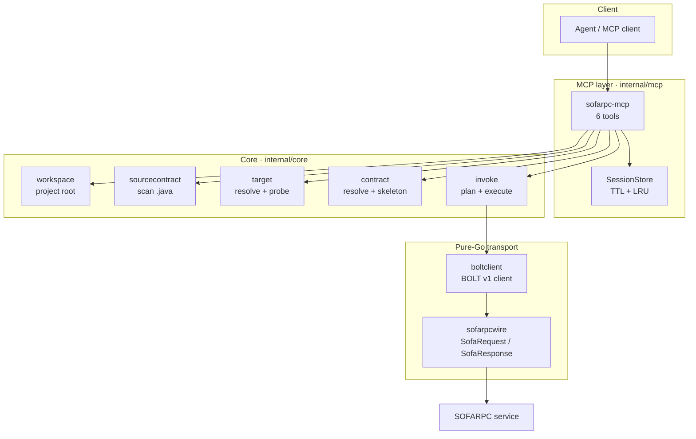
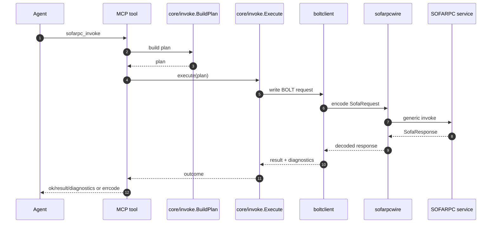

# sofarpc-cli Architecture

This document defines the pure-Go mainline architecture of `sofarpc-cli`.
It intentionally omits migration steps and compatibility concerns. The system
described here is the one the project should optimize around.

## 1. Core idea

`sofarpc-cli` is an agent-first local MCP server for SOFARPC generic invoke.
Its smallest useful unit is:

```text
service + method + paramTypes + args + target
-> build a plan
-> encode a SofaRequest
-> send one BOLT request
-> decode one SofaResponse
-> return JSON plus structured diagnostics
```

Everything else exists only to make that loop reliable for agents.

## 2. Design principles

1. **Agent-first surface.** The public API is six MCP tools with typed JSON
   inputs and outputs.
2. **Single visible runtime.** Users and agents interact with one binary:
   `cmd/sofarpc-mcp`.
3. **Pure-Go invoke path.** Direct invocation is implemented in Go for
   `direct + bolt + hessian2`.
4. **Source-first contract guidance, mandatory execution.** `describe`
   should work from local Java sources when they exist, but invoke must remain
   usable in trusted mode without any local contract cache requirement.
5. **Project defaults live in MCP env.** Target defaults are attached to the
   MCP server entry for a project, not to a repo-local manifest.
6. **Structured recovery.** Errors return stable codes and next-step hints so
   agents can recover by calling another tool, not by parsing prose.

## 3. System topology



The architectural split is:

- `internal/mcp` exposes the public tool contract.
- `internal/sourcecontract` materializes contract information by scanning
  project Java sources at startup.
- `internal/core` owns planning, target resolution, contract handling, and
  execution policy.
- `internal/boltclient` and `internal/sofarpcwire` own the wire protocol.
- no Java sidecar or local contract persistence is required for the mainline
  path.

## 4. Public MCP surface

The public API is fixed at six tools.

| Tool | Purpose |
| --- | --- |
| `sofarpc_open` | Open a workspace and return project root, resolved target, capabilities, and a session id. |
| `sofarpc_target` | Resolve the effective target and optionally probe reachability. |
| `sofarpc_describe` | Resolve overloads and build a JSON skeleton when contract information is available. |
| `sofarpc_invoke` | Build a plan and execute it. `dryRun=true` returns the plan only. |
| `sofarpc_replay` | Re-run a captured plan from `sessionId` or a literal `payload`. |
| `sofarpc_doctor` | Run structured diagnostics across target, workspace state, and invoke prerequisites. |

All tools speak JSON. All tool failures use stable `errcode` values and may
include a machine-usable recovery hint.

Example:

```json
{
  "code": "target.unreachable",
  "message": "direct dial failed: ...",
  "phase": "invoke",
  "hint": {
    "nextTool": "sofarpc_target",
    "nextArgs": { "explain": true },
    "reason": "the configured target could not be reached"
  }
}
```

## 5. Configuration and target model

`sofarpc-cli` has no project manifest and no repo-local target file. Target
resolution is:

```text
per-call MCP input > MCP server env > built-in defaults
```

This is implemented by `internal/core/target.Resolve`.

### 5.1 Supported fields

Resolved target config contains:

- `mode`
- `directUrl`
- `registryAddress`
- `registryProtocol`
- `protocol`
- `serialization`
- `uniqueId`
- `timeoutMs`
- `connectTimeoutMs`

Built-in defaults:

- `protocol = bolt`
- `serialization = hessian2`
- `timeoutMs = 3000`
- `connectTimeoutMs = 1000`

`mode` is inferred from the resolved fields:

- `directUrl != ""` -> `direct`
- `registryAddress != ""` -> `registry`
- neither -> unresolved target

### 5.2 Project-scoped MCP env

Per-project defaults belong on the MCP server entry for that project.

```json
{
  "mcpServers": {
    "sofarpc-demo": {
      "command": "/abs/path/to/sofarpc-mcp",
      "env": {
        "SOFARPC_PROJECT_ROOT": "/abs/path/to/project",
        "SOFARPC_DIRECT_URL": "bolt://host:12200",
        "SOFARPC_PROTOCOL": "bolt",
        "SOFARPC_SERIALIZATION": "hessian2"
      }
    }
  }
}
```

With a project-level MCP env or `.sofarpc/config*.json`, normal
`sofarpc_invoke` requests do not need to repeat `directUrl`. Per-call target
fields exist only for explicit override. Project config does not accept a
literal `mode`; the mode is derived from the first endpoint selected by
priority (`directUrl` for direct, `registryAddress` for registry).

### 5.3 `sofarpc_target`

`sofarpc_target` is the inspection tool for target resolution. It returns:

- resolved `target`
- contributing `layers`
- project `configErrors`, if `.sofarpc/config*.json` could not be parsed
- optional `trace`
- optional `explain`
- a cheap TCP `probe`

It accepts optional `project` or `cwd` fields so diagnostics can inspect the
same project context that produced an invoke/replay failure.

The probe only checks whether a TCP connection can be opened within
`connectTimeoutMs`. It does not perform a SOFA handshake.

## 6. Workspace and session model

`sofarpc_open` establishes the working context for a project:

- resolve project root from `cwd` or `project`
- resolve the ambient target from MCP env
- return capabilities and a new session id

Representative output:

```json
{
  "sessionId": "ws_...",
  "projectRoot": "/abs/path",
  "target": { "mode": "direct", "directUrl": "bolt://..." },
  "capabilities": {
    "directInvoke": true,
    "describe": true,
    "replay": true
  },
  "contract": {
    "attached": true,
    "source": "sourcecontract",
    "indexedClasses": 692,
    "indexedFiles": 692,
    "parsedClasses": 0
  }
}
```

Sessions are deliberately small and disposable:

- in-memory only
- TTL 24 hours
- capacity 256
- LRU eviction

Each session stores:

- `id`
- `projectRoot`
- `target`
- `createdAt`
- `lastPlan`

This is enough to support `replay` and avoid forcing the agent to respecify the
same call context repeatedly.

## 7. Contract model

The contract layer exists to bridge Java method signatures into agent-editable
JSON. In the pure-Go mainline, `cmd/sofarpc-mcp` attaches a store built by
scanning `.java` files under `SOFARPC_PROJECT_ROOT`. It owns:

- overload resolution
- parameter and return type resolution
- JSON skeleton generation
- `@type` injection for user-defined Java objects

This logic lives in `internal/core/contract`.

### 7.1 Describe

`sofarpc_describe` uses the attached source-derived contract store to:

1. resolve matching overloads
2. pick the selected signature
3. build a JSON skeleton for agent editing

Describe diagnostics include:

- `contractSource`
- `cacheHit`
- `contract.indexedClasses`
- `contract.indexedFiles`
- `contract.parsedClasses`
- `contract.indexFailures`
- `contract.parseFailures`

The source scan is best-effort:

- hidden directories are skipped
- `src/test` trees are skipped
- common build-output directories are skipped

If a workspace has no Java sources, `describe` is unavailable and invoke falls
back to trusted mode.

### 7.2 Trusted mode

If contract information is unavailable, invoke still works as long as the
caller provides:

- `service`
- `method`
- `types`
- `args`

In trusted mode:

- no overload disambiguation happens
- no skeleton is generated
- `contractSource` is marked as trusted

Trusted mode is important because execution is the core feature; contract
guidance is an optimization layer on top of it.

## 8. Invoke pipeline

Invoke is split into two phases:

1. plan building
2. plan execution

Both are owned by `internal/core/invoke`.

### 8.1 Plan building

`BuildPlan` merges:

- target resolution
- contract resolution, if contract information exists
- argument normalization
- invoke-level fields such as `version` and `targetAppName`

The plan is the stable unit shared by:

- `sofarpc_invoke`
- `sofarpc_replay`
- dry-run output

Facade-backed plan building performs contract-aware argument normalization before
execution:

- DTO objects are upgraded to canonical `{"@type":"..."}` payloads
- nested DTOs and `List<DTO>` / `Map<String, V>` values are normalized
  recursively
- common numeric Java types such as `BigDecimal` and `BigInteger` are wrapped
  into typed-object form

Trusted mode deliberately skips this step. In trusted mode the caller owns the
exact Java payload shape.
- session capture

Key plan fields:

- `service`
- `method`
- `paramTypes`
- `returnType`
- `args`
- `version`
- `targetAppName`
- `target`
- `overloads`
- `selected`
- `contractSource`
- `targetLayers`
- `argSource`

### 8.2 Execution rule

The pure-Go mainline supports one concrete invoke shape:

- `mode = direct`
- `protocol = bolt`
- `serialization = hessian2`

If a call does not fit that shape, it is outside the mainline architecture
described here.

### 8.3 Sequence



### 8.4 Transport responsibilities

`internal/boltclient` owns:

- BOLT v1 request framing
- request/response correlation
- low-level socket I/O
- transport-level timeouts

`internal/sofarpcwire` owns:

- `SofaRequest` construction
- generic invoke payload encoding
- `targetServiceUniqueName = service:version[:uniqueId]`
- SOFA header fields such as method name, target service, generic type, and
  optional target app
- `SofaResponse` decoding into JSON-friendly data

Direct-path diagnostics include:

- `transport`
- `target`
- `requestId`
- `requestCodec`
- `requestClass`
- `targetServiceUniqueName`
- `responseStatus`
- `responseClass`
- `responseCodec`
- `responseContentLength`

This is the core runtime path the project should continue to harden.

## 9. Replay and diagnostics

### 9.1 Replay

`sofarpc_replay` exists so an agent can re-run a call without rebuilding the
arguments or target context.

Input is exactly one of:

- `sessionId`
- `payload`

`payload` is a serialized invoke plan. Replay is not a separate protocol; it is
the same execution path as invoke after plan building is skipped.

`dryRun=true` makes replay a safe inspection mechanism for captured plans.

### 9.2 Error model

`internal/errcode` defines stable error groups:

- `input.*`
- `target.*`
- `contract.*`
- `workspace.*`
- `runtime.*`

Representative codes:

- `target.missing`
- `target.unreachable`
- `contract.method-not-found`
- `workspace.facade-not-configured`
- `runtime.deserialize-failed`
- `runtime.rejected`

The important property is not only stable codes, but stable recovery hints.

### 9.3 `sofarpc_doctor`

`sofarpc_doctor` is the catch-all diagnostic tool. It should answer:

- is the target configuration valid
- is the target reachable
- is the current workspace sufficiently specified for describe or trusted-mode invoke
- is the current workspace/session state usable for invoke or replay

Each check returns:

- `name`
- `ok`
- `detail`
- optional `nextStep`

This gives agents a deterministic escalation path when invoke cannot proceed.

## 10. Directory map

```text
cmd/
  sofarpc-mcp/           MCP entrypoint
  spike-invoke/          direct-transport validation CLI
internal/
  boltclient/            pure-Go BOLT client
  sofarpcwire/           SofaRequest / SofaResponse encoding
  sourcecontract/        Java source scan -> contract store
  errcode/               stable error codes + recovery hints
  mcp/                   tool registration + handlers
  core/
    workspace/           project root resolution
    target/              precedence chain + TCP probe
    contract/            overload resolution + skeleton generation
    invoke/              plan building + execution
  javatype/              Java type classification helpers
docs/
  architecture.md        this document
```

## 11. Non-goals

The pure-Go mainline deliberately does not include:

- a repo-local target manifest
- a local contract persistence format as an architectural prerequisite
- a larger MCP tool surface for every sub-step
- non-generic invoke modes
- pure-Go registry resolution
- durable session storage

Those are outside the architecture contract described here.
