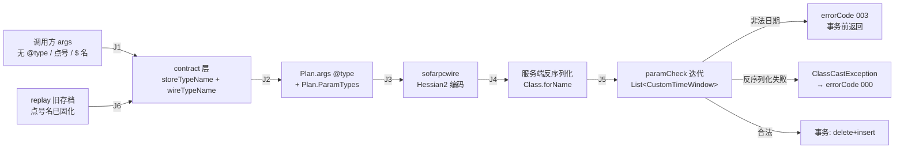

# Java 静态嵌套 DTO 二进制类名修复 —— 端到端测试计划（Delta Plan）

- 计划模式：**Delta Plan**（验证对象是单个 bounded change：commit `d35539c`，仅改类型名在链路上的表示，不改业务语义）
- 被验证改动：`d35539c` fix(contract): send JVM binary names for nested classes in generic invoke
- 真实目标：`bolt://10.74.194.42:12200`，`SeasonBgFacade#upsertSeasonTimeWindow`
- 关联 run：`e2e-verify-nested-dto-binaryname-20260728`
- 输出语言：中文（代码标识符、路径、类名、错误码原文保留）

## Overview

**覆盖**：链路触达边 4 条（客户端类型名生成 → Hessian2 编码 → 服务端反序列化 → paramCheck 迭代嵌套集合）；场景 7 个，Core Slice 5 个**全部 read-only**（在服务端事务开始前返回，零 DB 写入）。

**核心判据**：服务端 `paramCheck` 必须迭代 `List<CustomTimeWindow>` 并读取每个元素的 `startDate`。嵌套 DTO 若未被正确实例化（退化为 Map），该迭代抛 ClassCastException → 被包装成 `errorCode 000`；正确实例化则读到非法日期 → `errorCode 003`。**故意用非法日期做探针，使"修复生效"与"零副作用"同时成立。**

**Top 风险**：① 客户端二进制版本混淆（同机同时存在新旧二进制，旧进程会复现原 bug，误判为修复失效）；② 写场景 S4 是 `destructive-delete`（服务端按 seasonId 全量 delete+insert），未经授权不得执行；③ 测试环境部署版本与本地 HEAD 不一致。

**开放缺口**：3 项，均已定性（见 Gaps）——多级嵌套/Map/数组场景无真实 facade 承载（路由到单测，已覆盖）；MCP 路径待用户重连（blocked）；测试环境版本与本地源码文案不一致（accepted，不影响判据）。

## 1. Source Inventory

| 来源 | 用途 | 状态 |
|---|---|---|
| `sofarpc-cli` commit `d35539c`（11 文件，+1114/−22） | 被验证的改动本体 | confirmed by source |
| `internal/core/contract/binaryname.go` | `storeTypeName`/`wireTypeName`/`WireParamTypes`/`RewriteWireTypeNames` | confirmed by source |
| `internal/core/invoke/plan.go:298-303`（skeleton 分支 + `ParamTypes`） | 两条旁路的重写点 | confirmed by source |
| `internal/mcp/replay.go`（执行前救援） | replay 场景依据 | confirmed by source |
| `UpsertSeasonTimeWindowRequest.java`（facade 模块） | 嵌套 DTO 结构：`List<CustomTimeWindow>`，字段 code/name/startDate/endDate | confirmed by source |
| `SeasonBgFacadeImpl.java:577-635`（`paramCheck` → `validateDateFormats` → `isValidDate`） | **核心判据来源**：迭代嵌套集合读 `startDate` | confirmed by source |
| `SeasonTimeWindowService.java`（`upsertSeasonTimeWindow`） | 写路径：`deleteBySeasonId` + `batchInsertCompetitionSchedule`（事务内） | confirmed by source |
| `.sofarpc/config.local.json`（fundsalesmrksupport） | 目标地址 + allowedServices（含 SeasonBgFacade） | confirmed by source |
| `docs/e2e-test/season-default-period-strategy/.../dps-003-upsert-trusted-binary-type.request.json` | 2026-07-27 run 的 trusted 存档，S5 replay 素材 + seasonId `1000002925130006` 来源 | confirmed by source |
| `sofarpc_doctor` 输出（2026-07-28） | target reachable、invoke-policy ok、contract 2438 类已索引 | confirmed by source |

### Document-Code Semantic Diff

| 契约声明 | 代码实际行为 | 差异 | 风险 | 处置 |
|---|---|---|---|---|
| 原 bug report：「使用点号类型名调用时…在业务代码迭代集合时触发类型转换异常」 | `SeasonBgFacadeImpl:585-588` `paramCheck` 在**进入 service 层之前**就迭代 `customerTimeWindows` 调 `validateDateFormats` | 迭代位置比 bug report 描述的更早（Facade paramCheck 而非 service 业务逻辑） | 低 | **强化判据**：失败点更靠前，意味着 003 探针在事务前返回，写风险为零 → S1 |
| 本地源码文案：`"自定义赛程日期格式不正确"`（`SeasonBgFacadeImpl:587`） | 测试环境实测返回：`"自定义时间区间开始日期格式错误，正确格式为yyyyMMdd"` | 文案不一致 → 测试环境部署版本 ≠ 本地 HEAD | 中 | Gap G3（accepted）：两版本的 paramCheck 都必须读 `startDate`，判据不依赖具体文案 → 断言用 `errorCode` 而非 errorMsg |
| 修复声称：「describe 可以继续展示源码规范名，但发送到 Hessian2 前应转换为 JVM 二进制名」 | `skeleton.go` 未改（展示点号名）；`normalizeObject`/`plan.go` 重写为 `$` 名 | 无差异，符合声称 | — | S6 同时断言两侧 |

## 2. Journey Graph（缩减至触达边）

| 边 | 消费 | 产出 | 状态/副作用 | 来源 |
|---|---|---|---|---|
| J1 | 用户 args（三种 @type 拼写） | 归一化后的类型标识 | 无副作用；`$`/`.` 经 store 验证判同一类型 | `binaryname.go:storeTypeName` |
| J2 | 归一化标识 + Store.BinaryName | `Plan.args[].@type` = `$` 名；`Plan.ParamTypes` = `$` 名 | 无副作用 | `normalize.go:normalizeObject`、`plan.go:177,300` |
| J3 | Plan | Hessian2 字节（`O` 类型定义 + methodArgSigs） | 网络请求 | `sofarpcwire/encoder.go` |
| J4 | 字节 | `UpsertSeasonTimeWindowRequest` 实例（含嵌套元素） | 服务端内存 | 服务端 SOFARPC |
| J5 | 请求实例 | 校验结果 | **零 DB 写入**（校验在事务外） | `SeasonBgFacadeImpl:581-590` |
| J6 | 已捕获 Plan（点号名） | 执行副本的 `$` 名（展示仍为点号名） | 无副作用 | `mcp/replay.go` |

## 3. Agent Execution Contract

- **Target surfaces**：`sofarpc-mcp call`（CLI，新二进制，`confirmed by source`：`sofarpc-mcp version` → `d35539c`）；MCP `sofarpc_invoke`（`blocked`：当前会话子进程为 11:02:50 启动的旧二进制）；只读探针 `SeasonBgFacade#querySeasonTimeWindow`（`assumed until executor probe`）。
- **Fixtures**：`SEASON_ID = 1000002925130006`（2026-07-27 run 已使用的自建赛季，`confirmed by source`：dps-003 存档）；自定义窗口 code 一律用 `E2EBIN_` 前缀标记归属。
- **Named variables**：`SEASON_ID`（S1–S5 消费）；`PLAN_DOT`（S6 dryRun 产出、S5 消费的点号名存档）；`BASELINE_WINDOWS`（S0 产出、S4 消费与比对）。
- **Probes/Oracles**：`result.fields.errorCode`（主判据）；`plan.args[0].customTimeWindows[0].@type` 与 `plan.paramTypes[0]`（客户端侧判据）；`diagnostics.responseStatus`（传输层健康）；`querySeasonTimeWindow` 返回的窗口列表（仅 S4）。
- **Waits**：同步 BOLT 调用，`timeoutMs=10000`、`connectTimeoutMs=1000`（项目配置）；无异步窗口、无轮询。
- **Cleanup**：`preserve`（default unless overridden）。Core Slice 全部 read-only，**无需清理**。S4 若获授权执行，会按 `SEASON_ID` 全量替换窗口，回滚方式是用 `BASELINE_WINDOWS` 重新 upsert 一次；**执行前必须先跑 S0 采基线**。
- **Blockers/Gaps**：MCP 路径需用户重连（G2）；多级嵌套/Map/数组无真实 facade 承载（G1）。

**Required capabilities**：CLI 新二进制 + `SOFARPC_ALLOW_INVOKE=true` + 目标可达（三者已 confirmed）。
**Optional probes**：DB 直查 `mrk_competition_schedule`（无凭据，`assumed until executor probe`，缺失不阻塞——`querySeasonTimeWindow` 可替代）。

## 4. Risk Map（缩减至涉及族）

| 风险族 | 是否适用 | 覆盖 |
|---|---|---|
| 主路径 | ✅ | S1（默认无 @type，最常见路径） |
| 边界/等价拼写 | ✅ | S2（`$` 名）、S3（点号名）——修复要求两者判同一类型 |
| 契约兼容（存档重放） | ✅ | S5（修复前捕获的点号名存档） |
| 客户端-服务端跨系统一致性 | ✅ | S6（客户端 plan 断言）+ S1（服务端行为断言）成对 |
| 读路径等价（migration 分支） | ❌ 不适用 | 无 schema 变更、无共享读表形状改动 |
| 并发 | ❌ 不适用 | 单次同步调用，无竞态实体；类型名解析无共享可变状态（resolver 为请求级） |
| 幂等/恢复 | ⚠️ 部分 | S4 的 delete+insert 天然幂等（全量替换），非本次改动引入 |
| 性能与规模 | ❌ 无预算 | 修复引入的资源上界已由单测断言（AllocsPerRun），无端到端延迟预算 → 不建场景 |
| 可观测性 | ✅ | S1 断言 `diagnostics` 段完整（requestId/responseStatus/transport） |
| 回归（非嵌套类调用） | ✅ | S7（对照：不含嵌套 DTO 的普通方法路径不受影响） |

## 5. Scenario Inventory

| Scenario | Group | Priority | Slice | Risk/Purpose | Probe/Oracle | Edges | Channel | Side-effect Class | Data policy | Related issue |
|---|---|---|---|---|---|---|---|---|---|---|
| S0 | 基线 | P1 | Core | 采集 `SEASON_ID` 当前窗口列表，供 S4 回滚与比对 | `querySeasonTimeWindow` 返回 `success=true`；记录窗口数与 code 列表为 `BASELINE_WINDOWS` | J1–J5 | CLI | read-only | preserve | — |
| S1 | 主判据 | **P0** | Core | 默认 contract-assisted（不写任何 `@type`）+ 非法日期：证明嵌套 DTO 在服务端被正确实例化 | `errorCode == "003"`（非 `"000"`）；且 plan 中 `customTimeWindows[0].@type` 以 `$CustomTimeWindow` 结尾 | J1–J5 | CLI | read-only | preserve | — |
| S2 | 等价拼写 | **P0** | Core | 显式提供 `$` 二进制名不再被 `input.args-invalid` 拒绝（F2） | 调用未被客户端拒绝；`errorCode == "003"` | J1–J5 | CLI | read-only | preserve | — |
| S3 | 等价拼写 | P1 | Core | 显式提供点号 canonical 名同样被接受并转换为 `$` 名（双向等价） | 不报 not assignable；plan `@type` 为 `$` 名；`errorCode == "003"` | J1–J5 | CLI | read-only | preserve | — |
| S4 | 写落库 | P1 | **Hazardous/Defer** | 合法请求真正提交事务并可回查 | `success=true` 且 `data == SEASON_ID`；`querySeasonTimeWindow` 能查到 `E2EBIN_*` 窗口 | J1–J5, I | CLI | **destructive-delete** | preserve（需先采 S0 基线） | — |
| S5 | replay | **P0** | Core | 修复前捕获的点号名存档，重放时被救援为 `$` 名（F3） | 存档文件内 `@type` 仍为点号名；执行返回 `errorCode == "003"`（而非 `000`） | J6, J1–J5 | CLI `-plan` | read-only | preserve | — |
| S6 | 客户端侧 | P1 | Core | describe 展示规范名 / plan 发送二进制名，两侧同时成立；`methodArgSigs` 亦为 `$` 名 | `dryRun` plan：`args[].@type` 含 `$`；`paramTypes[0]` 为顶层类（本方法非嵌套，断言逐字节不变） | J1–J2 | CLI dry-run | read-only（无网络） | preserve | — |
| S7 | 回归对照 | P2 | Extended | 不含嵌套 DTO 的调用路径不受修复影响 | 任一非嵌套入参方法调用成功返回，plan 中类型名不含 `$` | J1–J5 | CLI | read-only | preserve | — |

## 6. Test Scenarios（P0 + Core 展开）

### S1 —— 默认 contract-assisted 路径（主判据）

> DAG `N1` ｜ P0 ｜ `read-only` ｜ 就绪门：G-CLI-NEW + G-TARGET

- **Purpose/Risk**：这是原 bug 最常见的触发路径——用户从 describe 拷贝 skeleton、不手写任何 `@type` 直接调用。修复前此路径发出点号名导致 `errorCode 000`。
- **Sources**：`SeasonBgFacadeImpl:585-588`（迭代判据）、`plan.go:298-303`、`normalize.go:normalizeObject`
- **Edges**：J1→J2→J3→J4→J5
- **Setup**：CLI 新二进制；`-project C:/Users/hexin/Desktop/project/fundsalesmrksupport`；`SOFARPC_ALLOW_INVOKE=true`
- **Steps**：
  1. 构造 args：`seasonId=SEASON_ID`、`dictWindowCodes=["ALL"]`、`defaultCode="ALL"`、`customTimeWindows=[{code:"E2EBIN_S1", name:"E2E_S1", startDate:"2026-07-32", endDate:"20260820"}]`——**不写任何 `@type`**
  2. 先 `-dry-run` 取 plan，记录 `args[0].customTimeWindows[0].@type` → 产出 `PLAN_DOT` 对照值
  3. 去掉 `-dry-run` 执行真实调用
- **Expected**：
  - **硬断言（source-backed）**：`result.fields.errorCode == "003"`。依据：`paramCheck` 必须迭代集合读 `startDate` 才能判定格式；若嵌套元素退化为 Map，此处抛 ClassCastException 被包装为 `000`。**`000` 即判定失败**。
  - **硬断言**：dry-run plan 中嵌套 `@type` 以 `UpsertSeasonTimeWindowRequest$CustomTimeWindow` 结尾。
  - **硬断言**：`diagnostics.responseStatus == 0` 且 `transport == "direct-bolt"`（传输层健康，排除"因网络失败而非类型失败"）。
  - 观察并报告：`errorMsg` 具体文案（测试环境版本可能与本地源码不同，见 G3——**不作为判据**）。
- **Automation**：API integration
- **Isolation/Cleanup**：零写入，无需清理。非法日期使请求在事务前返回。

### S2 —— 显式 `$` 二进制名被接受（P0）

> DAG `N2` ｜ P0 ｜ `read-only` ｜ 就绪门：G-CLI-NEW + G-TARGET

- **Purpose/Risk**：修复前此路径被客户端拒绝：`input.args-invalid: explicit @type "...$CustomTimeWindow" is not assignable to declared type "...CustomTimeWindow"`（bug report 第 3 步）。
- **Sources**：`binaryname.go:storeTypeName`、`normalize.go:validateExplicitType`
- **Edges**：J1→J2→J3→J4→J5
- **Setup**：同 S1
- **Steps**：args 同 S1，但嵌套元素显式带 `"@type": "com.thfund.sales.fundsalesmrksupport.facade.model.request.challenge.bg.UpsertSeasonTimeWindowRequest$CustomTimeWindow"`
- **Expected**：
  - **硬断言**：客户端**不**返回 `input.args-invalid` / `not assignable`（`ok != false` 于计划阶段）
  - **硬断言**：`errorCode == "003"`
- **Automation**：API integration
- **Isolation/Cleanup**：零写入。

### S3 —— 显式点号 canonical 名（双向等价）

> DAG `N3` ｜ P1 ｜ `read-only` ｜ 就绪门：G-CLI-NEW + G-TARGET

- **Purpose/Risk**：等价性必须双向：调用方写点号名时也要被接受，并在发送前转成 `$` 名（否则修复只是把拒绝方向调换了）。
- **Sources**：`binaryname.go:wireTypeName`
- **Steps**：args 同 S1，嵌套元素显式带点号形式 `...UpsertSeasonTimeWindowRequest.CustomTimeWindow`
- **Expected**：**硬断言** 不报 not assignable；dry-run plan 中该 `@type` 已被改写为 `$` 形式；`errorCode == "003"`
- **Automation**：API integration
- **Isolation/Cleanup**：零写入。

### S5 —— replay 旧存档被救援（P0）

> DAG `N5` ｜ P0 ｜ `read-only` ｜ 就绪门：G-CLI-NEW + G-TARGET

- **Purpose/Risk**：F3 声称修复前捕获的存档（`@type` 已固化为点号名）在重放时被救援。若不成立，历史存档会继续复现 `000` 且现象与"服务端又坏了"无法区分。
- **Sources**：`mcp/replay.go`（执行前对副本重写 args 与 ParamTypes）、`cmd/sofarpc-mcp/call.go` 的 `-plan`
- **Edges**：J6→J1→J2→J3→J4→J5
- **Setup**：准备一份**点号名固化**的 plan JSON。取 S1 步骤 2 的 dry-run 输出，手工把嵌套 `@type` 改回点号名（模拟修复前捕获），保存为 `PLAN_DOT` 文件。
- **Steps**：
  1. 确认 `PLAN_DOT` 文件内嵌套 `@type` 确为点号名（`grep` 断言，避免验了个假存档）
  2. `sofarpc-mcp call -plan <PLAN_DOT>` 执行
- **Expected**：
  - **硬断言**：存档文件内容仍为点号名（未被就地篡改）
  - **硬断言**：执行返回 `errorCode == "003"`（若为 `000` 说明救援未生效）
- **Automation**：API integration
- **Isolation/Cleanup**：零写入（存档用的是 S1 的非法日期）。`PLAN_DOT` 文件保留在 run 目录作为证据。

### S6 —— 客户端两侧表示同时成立（无网络）

> DAG `N6` ｜ P1 ｜ `read-only` ｜ 就绪门：G-CLI-NEW（不需要目标可达）

- **Purpose/Risk**：修复的设计承诺是"describe 展示源码规范名 / 发送二进制名"。若 describe 也变成 `$` 名，说明改动越界；若 plan 是点号名，说明修复失效。
- **Sources**：`skeleton.go`（未改动）、`plan.go:177`
- **Steps**：① `sofarpc_describe`（或 CLI 等价）取 skeleton；② `-dry-run` 取 plan
- **Expected**：
  - **硬断言**：skeleton 中嵌套 `@type` 为**点号名**
  - **硬断言**：plan 中同一位置为 **`$` 名**
  - **硬断言**：`plan.paramTypes[0]` 为顶层类 `UpsertSeasonTimeWindowRequest`（不含 `$`）——本方法顶层入参非嵌套类，`WireParamTypes` 必须逐字节不改
- **Automation**：contract
- **Isolation/Cleanup**：无网络调用，零副作用。

## 7. Execution DAG

| Node | Scenario | Depends on | Consumes | Produces | Required capabilities | Side-effect scope | Isolation key | Parallel safety | Cleanup dependency | Disruptive marker |
|---|---|---|---|---|---|---|---|---|---|---|
| N6 | S6 | none | — | — | CLI dry-run | 无 | — | safe | 无 | none |
| N0 | S0 | none | `SEASON_ID` | `BASELINE_WINDOWS` | CLI + 目标可达 | 只读 `mrk_competition_schedule` | `SEASON_ID` | safe | 无 | none |
| N1 | S1 | N6 | `SEASON_ID` | `PLAN_DOT`（dry-run 产物） | CLI + 目标可达 | 无（事务前返回） | `SEASON_ID` | safe（只读语义） | 无 | none |
| N2 | S2 | N1 | `SEASON_ID` | — | CLI + 目标可达 | 无 | `SEASON_ID` | safe | 无 | none |
| N3 | S3 | N1 | `SEASON_ID` | — | CLI + 目标可达 | 无 | `SEASON_ID` | safe | 无 | none |
| N5 | S5 | N1 | `PLAN_DOT` | — | CLI `-plan` + 目标可达 | 无 | `SEASON_ID` | safe | 保留 `PLAN_DOT` 作证据 | none |
| N7 | S7 | N6 | — | — | CLI + 目标可达 | 无 | 其它 facade | safe | 无 | none |
| N4 | S4 | N0（必须先有基线） | `SEASON_ID`, `BASELINE_WINDOWS` | 落库窗口 `E2EBIN_*` | CLI + 目标可达 + **用户授权** | **写** `mrk_competition_schedule`（按 seasonId 全量 delete+insert） | `SEASON_ID` | **unsafe**：与任何同 seasonId 的操作互斥，且会删除该赛季既有窗口 | 用 `BASELINE_WINDOWS` 重新 upsert 回滚 | 破坏性写 |

DAG 无环；执行顺序可由 `Depends on` 推出：N6 → N0 → N1 → {N2, N3, N5, N7} →（授权后）N4。

### Executor Handoff Index

- **入口命令模板**：
  `SOFARPC_ALLOW_INVOKE=true sofarpc-mcp call -project "C:/Users/hexin/Desktop/project/fundsalesmrksupport" -service com.thfund.sales.fundsalesmrksupport.facade.background.SeasonBgFacade -method upsertSeasonTimeWindow -args-file <场景 args 文件> [-dry-run]`
  replay：`... call -project <同上> -plan <PLAN_DOT 文件>`
- **产物落盘**：`docs/e2e-test/nested-dto-binary-name/e2e-run-nested-dto-binary-name-<timestamp>/`，含 `execution-report.md`、`scripts/<scenario>.args.json`、`evidence/<scenario>.out.json`
- **Core Slice**：S6, S0, S1, S2, S3, S5（全部 read-only）
- **不得自动执行**：S4（`destructive-delete`，需用户显式授权）
- **判据速查**：`errorCode == "003"` 通过；`errorCode == "000"` 失败（嵌套 DTO 未正确实例化）；客户端 `not assignable` 失败（等价性未生效）
- **失败定性提示**：若 `errorCode 000` 且 plan 中 `@type` 为点号名 → `tooling`（跑到了旧二进制），先核 `sofarpc-mcp version`；若 plan 为 `$` 名但仍 `000` → `product`

## 8. Closure

### Coverage Matrix

| 需求/风险 | 边 | 场景 |
|---|---|---|
| F1：默认路径发二进制名 | J1–J5 | S1, S6 |
| F1：`methodArgSigs` 亦为二进制名 | J2 | S6（本方法顶层非嵌套，断言不变）+ 单测 `TestBuildPlan_ParamTypeSignaturesUseBinaryNestedTypeNames` |
| F2：`$`/`.` 判同一类型（双向） | J1 | S2, S3 |
| F3：replay 旧存档救援 | J6 | S5 |
| describe 展示规范名（设计承诺） | J1 | S6 |
| 真实落库不受影响 | I | S4（需授权） |
| 非嵌套调用零回归 | J1–J5 | S7 + 单测基线 361 用例 |

### Gaps, Assumptions, Questions

| ID | 内容 | 处置 |
|---|---|---|
| G1 | 多级嵌套（`Outer.Inner.Deep`）、`Map<K,Outer.Inner>`、嵌套 DTO 数组在本 facade 无对应方法承载 | **out-of-scope**（路由到单测）：已由 `TestNestedDTO_WireTypeNameIsBinaryName`（含 Map/数组/多级）与 `TestNestedClassInsideLiteralDollarOuter` 覆盖，端到端无真实载体 |
| G2 | MCP `sofarpc_invoke` 路径当前跑旧二进制（会话子进程 11:02:50 启动，二进制构建于 13:09:55） | **blocked**：需用户重连 MCP。已取得的旧二进制结果（`000` + 点号名）作为**修复前对照证据**保留 |
| G3 | 测试环境部署版本 ≠ 本地 HEAD（错误文案不同） | **accepted**：判据用 `errorCode` 不用 `errorMsg`；两版本 `paramCheck` 都必须读 `startDate`，判据成立 |
| A1 | `SEASON_ID=1000002925130006` 在测试环境仍存在 | `assumed until executor probe`：S0 会证实；若 `getSeasonOrThrow` 抛错，改用其它 E2E 自建赛季 |
| A2 | 非法日期 `2026-07-32` 必然被 `isValidDate` 拒绝（长度 8 ≠ 10） | `confirmed by source`：`isValidDate` 先判 `length() != 8` |

### Agent-ready Gates

| Gate | 内容 | 状态 |
|---|---|---|
| G-CLI-NEW | `sofarpc-mcp version` 输出含 `d35539c`（新二进制） | confirmed by source（13:09:55 安装） |
| G-TARGET | `sofarpc_doctor` target=ok 且 invoke-policy=ok | confirmed by source（本日已探） |
| G-AUTH-S4 | 用户显式授权破坏性写场景 | **未取得** → S4 不得执行 |

**退出判据**（default unless overridden）：Core Slice（S6/S0/S1/S2/S3/S5）全部 pass，且 S1 与 S5 的 `errorCode` 均为 `003`。

### Scenario Slices

- **Core Slice**：S6 → S0 → S1 → S2/S3/S5。全部 read-only，一轮跑完即可关闭主风险。
- **Extended Slice**：S7（非嵌套回归对照，单测已覆盖同一性质，端到端为补充信号）。
- **Hazardous/Defer**：S4（`destructive-delete`：服务端按 seasonId 全量 delete+insert，会清掉该赛季既有窗口）。延后理由：修复的要害是类型名表示，S1 的 `003` 已证明嵌套 DTO 被正确实例化；落库能力属既有功能且 2026-07-27 run 已用 trusted 模式验过。需用户授权 + 先跑 S0 采基线后方可执行。
