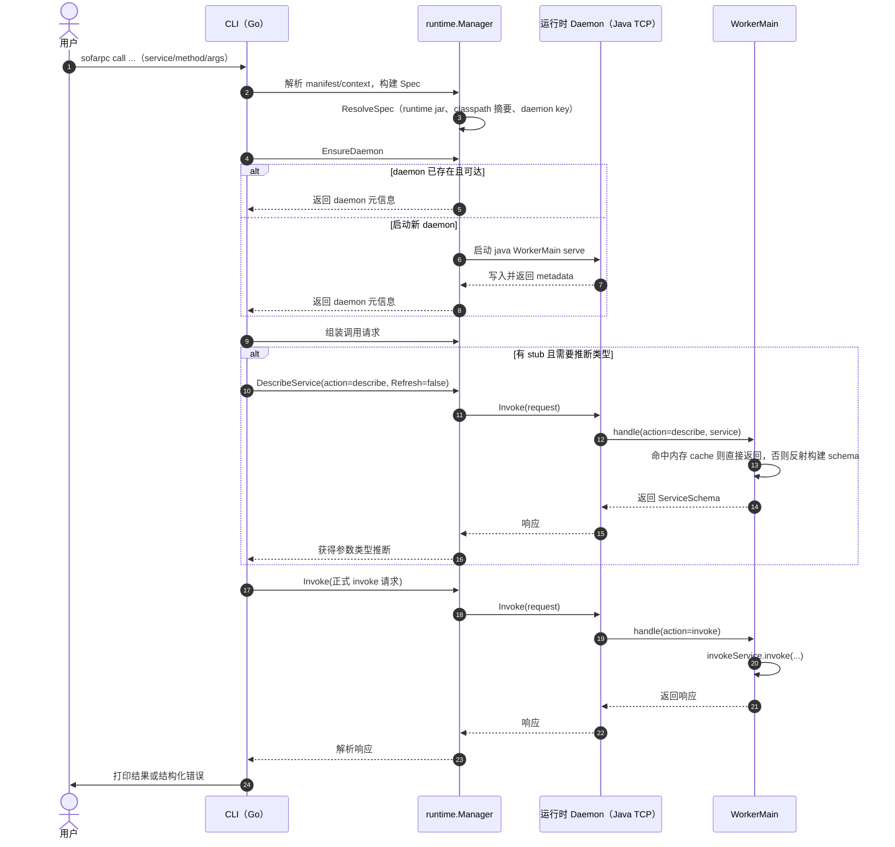
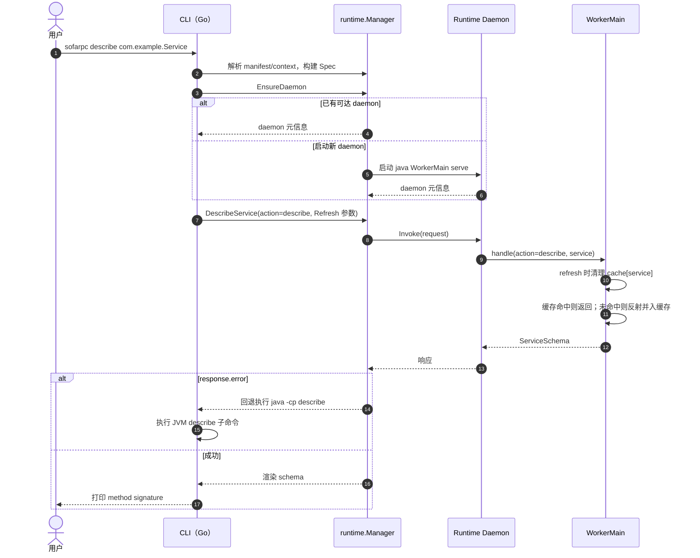

# sofarpc-cli 使用说明

构建、命令、manifest、runtime source 与诊断的详细参考。
设计思路见 [sofarpc-cli-design.md](./sofarpc-cli-design.md)。

架构：

- Go CLI 负责配置解析、runtime 选择、daemon 管理与交互体验
- Java worker runtime 负责真正的 SOFARPC 调用
- 本地 runtime 缓存与 daemon 池按 runtime 版本、runtime 摘要、stub 内容摘要、Java 主版本号分片

## 当前能力

可用命令：

- `call`
- `describe`
- `doctor`
- `context`
- `manifest`
- `runtime`
- `daemon`

当前 runtime 特性：

- SOFARPC runtime 默认版本 `5.7.6`
- payload mode：`raw`、`generic`、`schema`
- target mode：`direct`、`registry`
- 本地 runtime 安装与缓存
- runtime source：`file`、`directory`
- 本地 daemon 查看与清理
- 接口反射由 daemon 进程内存缓存

## 仓库结构

- `cmd/sofarpc`：Go CLI 入口
- `internal/cli`：CLI 子命令实现
- `internal/config`：本地配置与 manifest 持久化
- `internal/runtime`：runtime 选择、daemon 池、source 解析、诊断
- `runtime-worker-java`：Java worker runtime
- `internal/rpctest`：Go 版 detect-config、schema/index 生成与 case 回放实现
- `spoon-indexer-java`：基于 Spoon 的 facade 索引器
- `skills/`：随 CLI 一起分发的 Claude Code skills（当前是 `call-rpc`）

## 前置依赖

- **Go 1.26+** — 用于构建或运行 CLI（`go version`）
- **JDK 8+** — worker runtime 使用 Java 8 字节码；需要在 `PATH` 中或通过 `--java-bin` 指定（`java -version`）
- **Maven 3.6+** — 用于构建 worker jar（`mvn -version`）

构建前先确认这三项都在 `PATH` 中。

## 安装

### 全新机器流程

1. 安装上面列出的依赖。
2. 克隆仓库：

   ```powershell
   git clone <repo-url> sofarpc-cli
   cd sofarpc-cli
   ```

3. 构建 Java worker 与 Go CLI：

   ```powershell
   mvn -f runtime-worker-java/pom.xml package
   go build -o bin/sofarpc.exe ./cmd/sofarpc
   ```

   产物：

   - `runtime-worker-java/target/sofarpc-worker-5.7.6.jar`
   - `bin/sofarpc.exe`（macOS/Linux 下文件名是 `bin/sofarpc`，去掉 `.exe`）

4. 把 `bin\` 加入 `PATH`，或直接把二进制复制到任意已在 `PATH` 中的目录。之后任何位置都能用 `sofarpc ...`。

### 构建其他 SOFARPC 版本

shaded jar 的文件名跟随 `sofa-rpc.version` 这个 Maven 属性（默认 `5.7.6`）。覆盖该属性即可对齐其他企业版 sofa-boot：

```powershell
mvn -f runtime-worker-java/pom.xml -Dsofa-rpc.version=5.8.0 package
```

产物：`runtime-worker-java/target/sofarpc-worker-5.8.0.jar`。

### 拷贝预编译的 worker jar

如果新机器连不到 Maven 中央仓库或公司内网仓库，可以从其他机器上复制现成的 jar 直接注册——完全跳过 Maven：

```powershell
sofarpc runtime install --version 5.7.6 --jar D:\transfer\sofarpc-worker-5.7.6.jar
```

CLI 二进制本身仍然需要 Go 编译，或者把 `sofarpc.exe` 也一起拷过来。

### 不构建二进制直接运行

调试 Go 代码时可以跳过 `go build`：

```powershell
go run ./cmd/sofarpc help
```

日常使用建议把构建好的二进制放到 `PATH`，更快也免去重复编译。

## Claude Code Skill

仓库 `skills/call-rpc/` 下是 `call-rpc` skill，安装后会复制到
`~/.claude/skills/`，本质上是 `sofarpc call` 的薄封装入口。

### 安装

```powershell
sofarpc skills install                  # 默认安装 call-rpc
sofarpc skills install --force          # 覆盖已有安装
sofarpc skills install --dry-run        # 预览拷贝
sofarpc skills where                    # 查看源/目标路径
sofarpc skills list                     # 列出仓库内 skill
```

skill 不做项目接入、索引构建或用例回放；这些仍然是 `sofarpc facade ...` 的范围。

### 常见调用

```powershell
sofarpc call --context prod -data '[...]' com.example.OrderFacade.createOrder
```

## 快速上手

### 1. 创建可复用的 target context

直连 target：

```powershell
go run ./cmd/sofarpc context set dev-direct `
  --direct-url bolt://127.0.0.1:12200 `
  --protocol bolt `
  --serialization hessian2 `
  --timeout-ms 10000 `
  --connect-timeout-ms 5000
```

注册中心 target：

```powershell
go run ./cmd/sofarpc context set dev-zk `
  --registry-address zookeeper://127.0.0.1:2181 `
  --registry-protocol zookeeper `
  --protocol bolt `
  --serialization hessian2
```

按项目自动选择的 context（同一台机器可维护多个项目）：

```powershell
go run ./cmd/sofarpc context set project-a `
  --project-root C:\code\project-a `
  --direct-url bolt://127.0.0.1:12200 `
  --protocol bolt
```

切换激活的 context：

```powershell
go run ./cmd/sofarpc context use dev-direct
```

查看 context：

```powershell
go run ./cmd/sofarpc context list
go run ./cmd/sofarpc context show
go run ./cmd/sofarpc context show dev-direct
```

### 2. 验证 target 与 runtime 是否就绪

```powershell
go run ./cmd/sofarpc doctor --context dev-direct
```

`doctor` 会输出：

- 解析到的 manifest 路径
- 当前激活的 context
- 解析后的 target 配置
- 选用的 runtime jar 与 Java 版本
- 选用的 SOFARPC runtime 版本以及它的来源（`flag`、`manifest`、`default`）
- daemon 状态
- TCP 可达性
- 一次合成的 invoke 探针，区分 TCP 通了但 RPC 链路是否真正打通

### 3. 调用一个服务

完整 flag 形式：

```powershell
go run ./cmd/sofarpc call `
  --context dev-direct `
  --service com.example.UserService `
  --method getUser `
  --types java.lang.Long `
  --args "[123]"
```

位置参数简写（`<fqcn>.<method>`）：

```powershell
go run ./cmd/sofarpc call com.example.UserService.getUser "[123]"
```

打印完整结构化响应：

```powershell
go run ./cmd/sofarpc call `
  --context dev-direct `
  --service com.example.UserService `
  --method getUser `
  --types java.lang.Long `
  --args "[123]" `
  --full-response
```

成功时的默认行为：

- 只打印解码后的 `result`

失败时的行为：

- 把完整结构化错误响应打印到 `stderr`
- 进程退出码为 `1`

## 调用示例

### `call` 时序



下面的示例假设 `sofarpc.exe` 已在 `PATH` 中并且激活了名为 `dev-direct` 的 context。从源码运行时把 `sofarpc` 替换成 `go run ./cmd/sofarpc`。

### 简单请求 — 基础类型参数

一个 `Long` 入参，位置参数形式。配置了 stub jar 时 CLI 会反射推断 `--types`，因此下面这样就够了：

```powershell
sofarpc call com.example.UserService.getUser "[123]"
```

单参方法时 body 可以省略外层数组 —— CLI 会自动包成 `[123]`：

```powershell
sofarpc call com.example.UserService.getUser "123"
```

显式 flag 等价写法 — 没有 stub jar 或想指定具体重载时更稳：

```powershell
sofarpc call `
  --service com.example.UserService `
  --method getUser `
  --types java.lang.Long `
  --args "[123]"
```

成功时 CLI 只打印解码后的 `result`。加 `--full-response` 可以看到诊断信息（runtime jar、daemon key、Java 版本等）。

### 复杂请求 — DTO 入参 + stub jar

worker classpath 必须能解析业务 DTO，通过 `--stub-path` 把业务的 API jar 提供出来；body 用 `-d @file` 直接从文件读，避开 shell 转义：

```powershell
sofarpc call `
  --service com.example.OrderService `
  --method createOrder `
  --types com.example.OrderCreateRequest `
  --stub-path D:\projects\order-app\target\order-api.jar `
  -d @order.json
```

`order.json` 就是普通 JSON：

```json
[{"userId":123,"sku":"A1","qty":2}]
```

当默认值不合适时，常用的覆盖项：

- `--sofa-rpc-version 5.8.0` — 指定 runtime 版本
- `--java-bin "C:\Program Files\Zulu\zulu-8\bin\java.exe"` — 指定 JDK
- `--timeout-ms 15000` — 调大调用超时
- `--full-response` — 同时打印 runtime/daemon 诊断信息

如果同一组服务要反复调用，把服务元信息和 stub path 写进 `sofarpc.manifest.json`（见 [Manifest](#manifest)），这样位置参数形式就足够了。

### Body 输入形式

`--args`（别名 `--data` / `-d`，对齐 curl）支持三种形式：

- 内联 JSON：`-d "[123]"`
- `@path` — 从文件读（相对 cwd）：`-d @order.json`
- `-` — 从 stdin 读：`cat order.json | sofarpc call ... -d -`

复杂 DTO 一律用 `@file` 或 stdin，能彻底绕开 PowerShell / bash 的 JSON 转义。

## Describe

### `describe` 时序



反射 stub jar 里的接口，打印方法签名。schema 结果由 runtime daemon 进程内存缓存，共享给使用同一 `daemon-key` 的 CLI 进程（按 service 与 classpath digest 缓存）。

```powershell
sofarpc describe --stub-path target\order-api.jar com.example.OrderService
```

flag 必须放在位置参数 FQCN 前面（Go 的 flag 解析器遇到第一个非 flag 参数就会停止）。

绕开缓存重新跑 worker：

```powershell
sofarpc describe --refresh --stub-path target\order-api.jar com.example.OrderService
```

schema 结果不会落盘，不写本地文件，只保留在 daemon 进程内存中；daemon 退出即失效。
daemon key 也使用同一份 stub 内容摘要；stub jar 内容变化会触发新的 `daemon-key`，自动拉起新 worker，避免复用旧进程。新 worker 启动后，同一 runtime profile 下的历史 loopback worker 会被自动停止，减少旧进程留存。

## 解析顺序

`call` 与 `doctor` 的有效配置按以下顺序解析：

### Target 配置优先级

- 显式 CLI flag
- 指定的或当前激活的 context
- `manifest.defaultTarget`
- 内置默认值

内置默认值：

- `protocol = bolt`
- `serialization = hessian2`
- `timeoutMs = 3000`
- `connectTimeoutMs = 1000`

### Context 选择优先级

- `--context`
- `manifest.defaultContext`
- `context.set --project-root` 匹配当前项目路径（在没有显式 context 与 manifest defaultContext 时）
- 当前激活的本地 context

### SOFARPC runtime 版本优先级

- `--sofa-rpc-version`
- `manifest.sofaRpcVersion`
- 内置默认值 `5.7.6`

### Stub path 优先级

- `--stub-path`
- `manifest.stubPaths`
- 若两者都未配置，自动从 `<project>/.sofarpc/config.json` 的 `jarGlob` / `depsDir` 发现 jar

### 方法元信息优先级

- `--service`、`--method`、`--types`、`--payload-mode`
- `manifest.services` 中匹配的条目
- 对 `--types`：上述都没给且配了 stub jar 时，CLI 会反射接口并取该方法的 `paramTypes`（遇到重载歧义会报错 —— 显式传 `--types` 指定一个）

注意事项：

- `--args` 必须是合法 JSON
- 如果省略 `--args`，默认取 `[]`
- 若解析到的方法只有一个参数且 body 不是 JSON 数组，CLI 会自动包成 `[body]`
- 必须能解析出 direct target 或 registry target 之一
- manifest 中的相对 `stubPaths` 以 manifest 文件所在目录为基准

## Payload Mode

### `raw`

适用场景：

- 基础类型
- 普通 JSON 对象
- `Map` / `List` 类型 payload
- 通用冒烟测试
- stub jar 齐全时的 `OperationResult<T>` 这类返回壳

说明：

- 只要 worker classpath 能拿到 DTO，优先走 `raw`
- 如果顶层参数本身就是声明好的 DTO 类，`raw` 现在会直接按该类反序列化，所以 `List<FundAssetItem>` 这类嵌套字段也能正确还原
- 如果 Jackson 在响应侧内省 `dataOptional()` / `dataOrThrow()` 这类 helper getter 时炸掉，worker 会自动回退到 field-based 序列化

示例：

```powershell
go run ./cmd/sofarpc call `
  --context dev-direct `
  --service com.example.UserService `
  --method updateUser `
  --types com.example.UserUpdateRequest `
  --payload-mode raw `
  --args "[{\"id\":123,\"name\":\"alice\"}]"
```

### `generic`

适用场景：

- worker classpath 没有 DTO
- 想显式走 generic 调用路径

限制：

- SOFARPC 侧只拿到顶层 `paramTypes`
- `List<FundAssetItem>` 这类嵌套自定义集合元素，provider 侧仍可能被还原成 `LinkedHashMap`
- 不要因为返回壳暴露了 `Optional/helper getter` 就直接切 `generic`，优先试 `raw`

### `schema`

适用场景：

- 入参希望按 worker 侧已有的类型元数据来解释

当前边界：

- 有接口元数据时，`describe` 会保留完整泛型参数签名
- `schema` 会按这些签名还原嵌套集合 / Map 的元素类型
- `schema` 主要用于顶层参数本身就是 `List<CustomDTO>`、`Map<String, CustomDTO>` 这类泛型容器
- 如果完全不给 stub jar，`schema` 只能退回你显式传入的顶层类型

## Manifest

默认 manifest 路径：

- 当前工作目录下的 `sofarpc.manifest.json`

创建初始 manifest：

```powershell
go run ./cmd/sofarpc manifest init `
  --output sofarpc.manifest.json `
  --service com.example.UserService `
  --method getUser `
  --types java.lang.Long `
  --payload-mode raw `
  --direct-url bolt://127.0.0.1:12200
```

从已有 context 生成 manifest：

```powershell
go run ./cmd/sofarpc manifest generate `
  --context dev-direct `
  --output sofarpc.manifest.json `
  --service com.example.UserService `
  --method getUser `
  --types java.lang.Long `
  --payload-mode raw `
  --stub-path ..\\app\\target\\app-api.jar
```

manifest 示例：

```json
{
  "schemaVersion": "v1alpha1",
  "sofaRpcVersion": "5.7.6",
  "defaultContext": "dev-direct",
  "defaultTarget": {
    "mode": "direct",
    "directUrl": "bolt://127.0.0.1:12200",
    "protocol": "bolt",
    "serialization": "hessian2",
    "timeoutMs": 10000,
    "connectTimeoutMs": 5000
  },
  "stubPaths": [
    "../app/target/app-api.jar"
  ],
  "services": {
    "com.example.UserService": {
      "methods": {
        "getUser": {
          "paramTypes": [
            "java.lang.Long"
          ],
          "payloadMode": "raw"
        }
      }
    }
  }
}
```

## Runtime 缓存

列出已安装的 runtime：

```powershell
go run ./cmd/sofarpc runtime list
```

查看单个 runtime：

```powershell
go run ./cmd/sofarpc runtime show 5.7.6
```

从指定 jar 安装：

```powershell
go run ./cmd/sofarpc runtime install --version 5.7.6 --jar C:\path\to\sofarpc-worker-5.7.6.jar
```

从激活的 runtime source 或工作区构建产物安装：

```powershell
go run ./cmd/sofarpc runtime install --version 5.7.6
```

从指定的 runtime source 安装：

```powershell
go run ./cmd/sofarpc runtime install --version 5.7.6 --source local-cache
```

## Runtime Source

runtime source 是只在本地有效的配置项，用来定位 worker jar。

支持的 kind：

- `file`
- `directory`

### 本地文件 source

```powershell
go run ./cmd/sofarpc runtime source set `
  --kind file `
  --path C:\artifacts\sofarpc-worker-5.7.6.jar `
  local-file
```

### 本地目录 source

目录 source 会按以下顺序查找候选路径：

- `<base>/sofarpc-worker-<version>.jar`
- `<base>/<version>/sofarpc-worker-<version>.jar`
- `<base>/runtime-worker-java/target/sofarpc-worker-<version>.jar`

示例：

```powershell
go run ./cmd/sofarpc runtime source set `
  --kind directory `
  --path C:\artifacts\sofa-runtimes `
  local-dir
```

### 查看与切换 source

```powershell
go run ./cmd/sofarpc runtime source list
go run ./cmd/sofarpc runtime source show
go run ./cmd/sofarpc runtime source show local-dir
go run ./cmd/sofarpc runtime source use local-dir
go run ./cmd/sofarpc runtime source delete local-dir
```

## Daemon 管理

列出 daemon：

```powershell
go run ./cmd/sofarpc daemon list
```

查看单个 daemon：

```powershell
go run ./cmd/sofarpc daemon show <daemon-key>
```

停止单个 daemon：

```powershell
go run ./cmd/sofarpc daemon stop <daemon-key>
```

清理失效的 daemon 元信息与日志：

```powershell
go run ./cmd/sofarpc daemon prune
```

## 本地文件与目录

CLI 通过 `os.UserConfigDir()` 与 `os.UserCacheDir()` 把本地状态存放在仓库之外。

配置文件：

- `<configDir>/sofarpc-cli/contexts.json`
- `<configDir>/sofarpc-cli/contexts.template.json`
- `<configDir>/sofarpc-cli/runtime-sources.json`

初始化方式：

- `sofarpc skills install` 会输出模板文件路径 `contexts.template.json`
- 将模板复制为 `contexts.json` 后按需填写多个 context（可用 `projectRoot` 做项目映射）

缓存文件：

- `<cacheDir>/sofarpc-cli/runtimes/<version>/`
- `<cacheDir>/sofarpc-cli/daemons/`

Windows 上的典型位置：

- `%AppData%\sofarpc-cli\contexts.json`
- `%AppData%\sofarpc-cli\contexts.template.json`
- `%AppData%\sofarpc-cli\runtime-sources.json`
- `%LocalAppData%\sofarpc-cli\runtimes\`
- `%LocalAppData%\sofarpc-cli\daemons\`

## 备注与限制

- 当前默认 runtime 版本是 `5.7.6`
- `doctor` 验证 target 与 runtime 的可达性，但不会真正调用业务方法
- `call` 默认只打印解码后的 `result`；用 `--full-response` 看诊断信息
- 暂未文档化发布物打包流程；目前的使用方式是源码构建 + `go run` 或本地二进制
